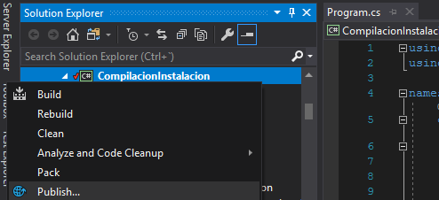
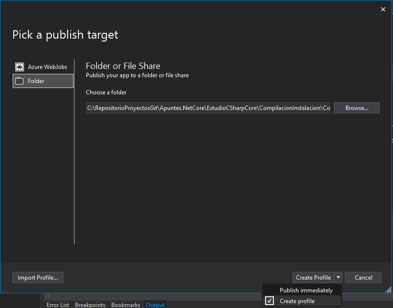
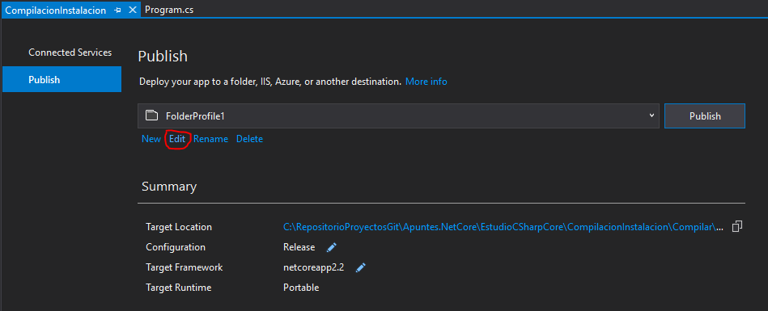
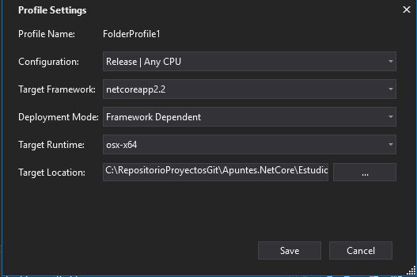
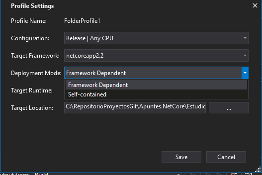
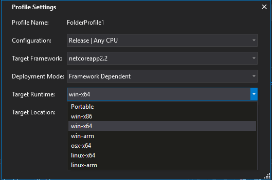
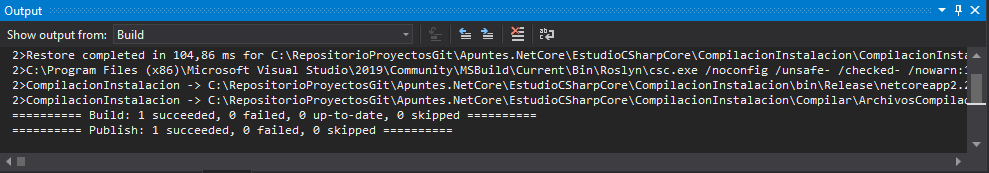

# Publish

Para compilar las **Release** del proyecto se usara la opcion "**Publish**"

Este programa nos compilara en:
- ``.exe`` para windows
- ``.dll`` para ser portable y poder ejecutarlo en todas las versiones de S.O
Tambien se puede compilar para MacOs y Linux, pero son archivos sin extension

Las publicaciones se van a hacer desde el Visual Studio:



Hacemos Click derecho en el proyecto principal de la solucion y le damos al boton Publish...



Dandole a **Browse** seleccionamos la carpeta donde vamos a extraer los binarios, una vez seleccionado le damos al boton **Create Profile**.



Al darle a **Create Profile** nos aparecera esta venta, para configurar las opciones de compilacion le daremos a "edit"



Cuando le demos a **edit** nos aparecera esta ventana
- `Configuration:` Seleccionamos si queremos publicar modo **Debug** o modo **Release**

- `Target Frameworks:` Seleccionamos la version del SDK con la que queremos compilar (la mejor siempre sera la ultima que podamos)

- `Deployment Mode:` Seleccionamos el modo de compilacion que tendra la aplicacion(Explicamos mas abajo)

- `Target Runtime:` Seleccionamos el sistema operativo y la arquitectura de este.



- `Framework Dependent:` Compila solo los archivos necesarios de librerias, clases etc creadas por el usuario, las librerias del **Framework** no se crearan como **.dll** porque depende de que este instalado

- `Self-contained:` Compila todas las librerias que usa el programa, se usa para no requerir de tener .net instalado en el equipo, por tanto aqui se crearan todas las **.dll** del framework



En esta opcion seleccionamos los diferentes sistemas operativos a los que ira destinada la aplicacion y la compilara en consecuencia.

La opción **Portable** crea un `.dll` y para ejecutarlo se usara el comando
````
dotnet nombrePrograma.dll
````



En la parte **Output** se mostrarán los resultados de la compilacion y extraccion de los archivos necesarios.