# WinRaR

Para compilar las aplicaciones desarrolladas en C# se usara "Publish"

Con este programa crearemos un ``exe`` autoextraible para descomprimir los archivos en una ruta como ``%programfiles%``
## Guía de compilación
---

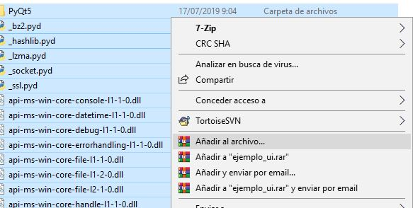

Seleccionamos los archivos y los "añadimos al archivo" para empezar la compresión.

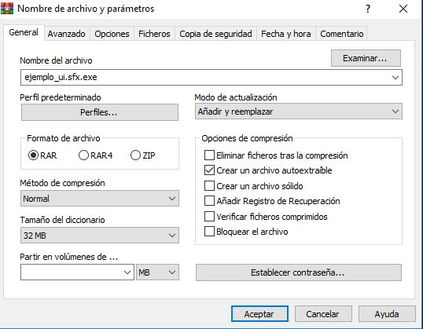

Marcamos la opcion "Crear un archivo autoextraible"

---
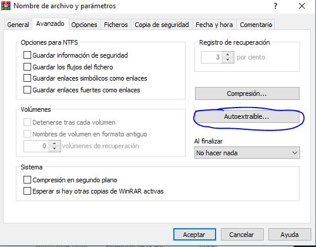

En avanzado, seleccionamos "Autoextraible..." para configurar el .exe

---
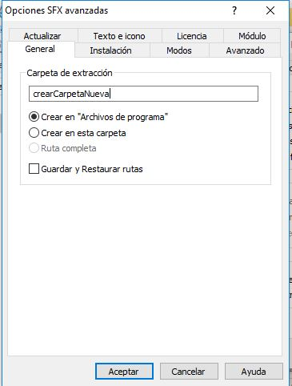

En general seleccionamos el nombre de la carpeta donde vamos a extraer todos los archivos del programa y también la ubicación donde vamos a crearla "Archivos de programa", etc.

---
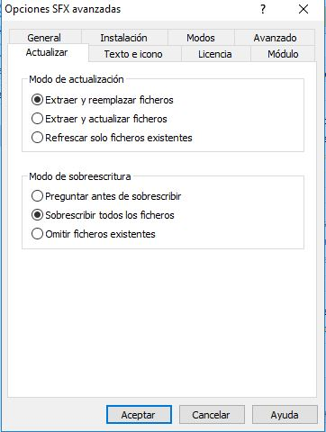

En actualizar depende del programa usaremos una opción u otra, si es para actualizar un programa ya instalado, pues actualizar ficheros, si es para instalar, pues extraer y reemplazar, etc.

---
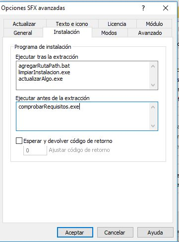

En Instalación pondremos los archivos que queremos ejecutar antes y después de la instalación del programa. la ruta se hace en base a como lo vemos en el explorador de archivos del winrar

---
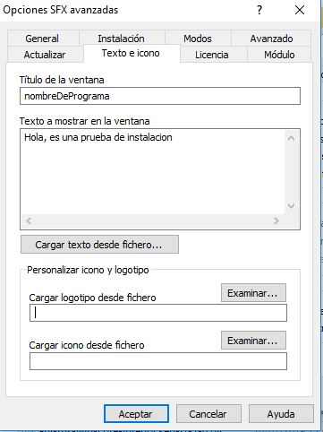

en Texto e Icono Pondremos el titulo de la ventana de instalación, la descripción del programa, el logo para el fondo y el icono del programa

---
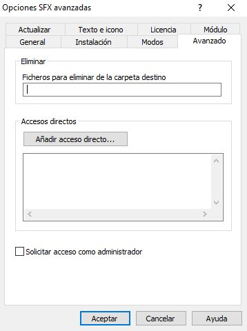

En avanzado podremos seleccionar ficheros a borrar de la carpeta, crear un acceso directo en el escritorio al programa y solicitar permisos de instalación(dependiendo de la ruta puede ser necesario)

---
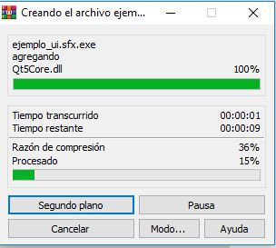

Le damos a aceptar en la ventana de configuración y a aceptar en la ventana principal del winrar y empezara la compresión

---
## INSTALACION

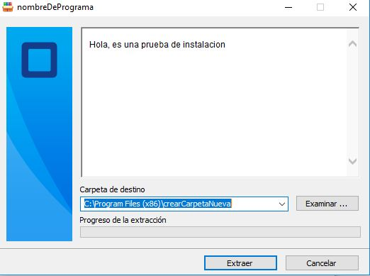

ejecutamos el archivo y nos da la opción de cambiar la ruta de instalación, sino sera esa por defecto

---
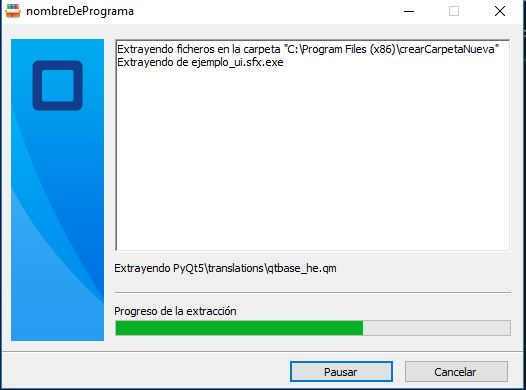

Se empezara a instalar, informando de los ficheros que esta extrayendo con una progressBar y un TextBox
