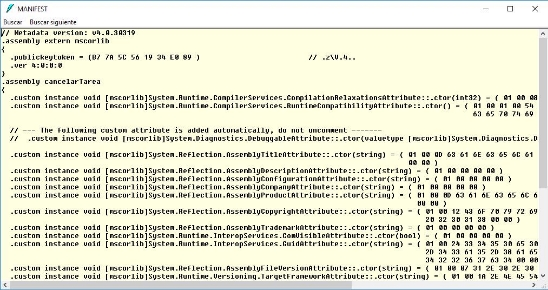
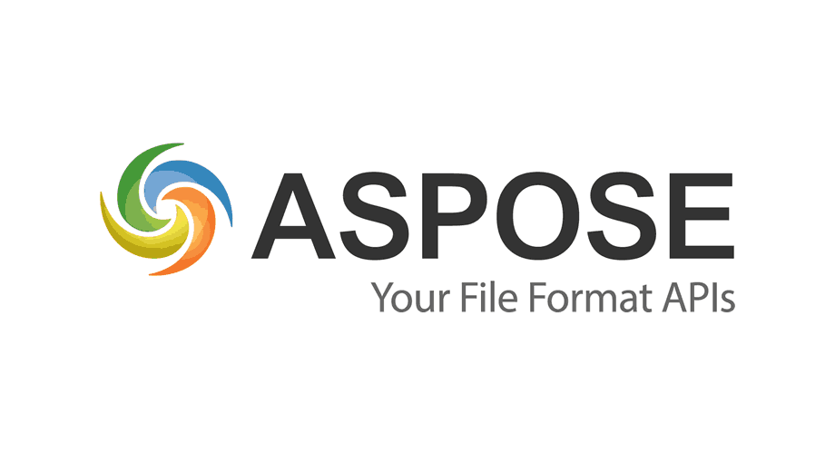
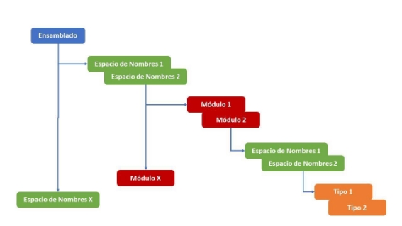



**Evaluation Only. Created with Aspose.Words. Copyright 2003-2021 Aspose Pty Ltd.**

Assembly (Ensamblado) – Curso Completo de Desarrollo C Sharp (#) – Ángel Arias 

Assembly 

Muchas veces, nos acostumbramos a simplemente escribir el código dentro del Visual Studio y, presionando F5 o Ctrl + F5 (Build) ejecutamos la aplicación para que esta sea ejecutada y, consecuentemente, probamos para ver si el resultado es el esperado. Pero, ¿Qué sucede realmente por detrás de este proceso? 

El **CLR (Common Language Runtime)** es un runtime común para todas las aplicaciones que utilizan el .NET Framework, de esta manera el CLR no conoce nada sobre el lenguaje de programación que hayamos escogido para realizar nuestro software. Cuando ejecutamos la aplicación dentro del Visual Studio, el compilador del lenguaje escogido es el encargado de la verificación de la sintaxis, analizando el código fuente y certificando que el código fuente que se ha escrito tiene algún sentido. Entre los numerosos compiladores disponibles C Sharp dispone del compilador csc.exe. 

Para entender mejor el proceso de compilación y creación del Assembly, imaginemos que vamos a realizar una aplicación de consola básica, es decir, utilizando el Notepad. Como no tendremos el soporte de Visual Studio en este momento, deberemos utilizar el compilador correspondiente del lenguaje para efectuar la compilación. Independientemente de cuál sea el lenguaje de programación y cual sea el compilador que estemos utilizando, el resultado de la compilación será el de un único archivo que será siempre el mismo: un módulo gestionado. Un módulo gestionado es un archivo portable (PE), que necesita obligatoriamente del CLR para poder funcionar. A continuación, podemos ver el proceso: 

**Módulo Gestionado Clase.cs Compilador C Sharp (IL y Metadatos)**

Dentro de la plataforma Microsoft .NET, un Assembly es un código parcialmente compilado, tratándose de una agrupación lógica de uno o más módulos gestionados o archivos de recursos. Además de eso, un Assembly es la más pequeña unidad de reutilización, seguridad y control de versión. Decimos parcialmente compilado, porque el código está en un lenguaje intermedio, llamado **MSIL**: ***Microsoft Intermediate Language***. 

Existen dos tipos de Assembly: EXE (Executable) y DLL (Dynamic Link Library).  

- **EXE**: Se generan cuando creamos una aplicación del tipo Windows Forms, Windows Service o una aplicación de Consola.  
- **DLL**: Se trata de una biblioteca de tipos que pueden ser utilizados por otras aplicaciones. Dentro de cada uno de estos tipos de Assemblies, puede haber otros sub- tipos que son:  

**Created with an evaluation copy of Aspose.Words. To discover the full versions of our APIs please visit: https://products.aspose.com/words/**
Assembly (Ensamblado) – Curso Completo de Desarrollo C Sharp (#) – Ángel Arias 

- **Single-file Assemblies**: son Assemblies que contienen solo un módulo gestionado dentro del mismo, el cual hará todo el trabajo necesario para que la aplicación o la biblioteca funcione. 
- **Multi-file Assemblies**: son Assemblies compuestos por más de un módulo gestionado, los cuáles son colocados dentro de este Assembly.  

Dentro de los Assemblies también tenemos **el manifiesto**. El manifiesto contiene todas las informaciones sobre los elementos que están contenidos dentro del Assembly, incluyendo todo lo que este expone al mundo. El manifiesto también informa todas las dependencias existentes en su Assembly para con otros Assemblies. ***Todos los Assemblies tienen que tener un manifiesto de manera obligatoria***. 

Uso directo de archivos DLL 

En cualquier entorno de desarrollo de muy importe poder encapsular la funcionalidad que nos proveen las bibliotecas ya que estas nos dan la posibilidad de construir módulos y poder usar el mismo código en diferentes ubicaciones. Además, podemos ahorrar recursos y tener binarios cargados solo si lo requiere la funcionalidad que está usando un programa en un momento determinado (***Dynamic Linking***). Las bibliotecas pueden ser parte de una sola aplicación o puede compartirse su uso para otros programas, implementados por nosotros o incluso por otras organizaciones. 

Antes, las bibliotecas de vínculos dinámicos (***DLL***) se ubicaban a través de la configuración PATH del entorno del sistema y del registro de Windows. Las DLL globales y compartidas se almacenaban en la carpeta del sistema de Windows. Estos mecanismos tienen ciertos inconvenientes. Una es que no podemos mover las aplicaciones dentro de nuestro sistema de archivos porque el Registro de Windows tiene las rutas almacenadas. En los sistemas especialmente grandes esto es un problema importante, ya que tenemos que tener en cuenta que los datos se pueden mover, los discos duros se pueden reorganizar a nivel de toda una organización, diferentes estructuras de ficheros según las versiones de los sistemas operativos, etc. 

Con .NET, el Registro de Windows ya no se usa y las bibliotecas se almacenan junto con una aplicación como ensamblados privados o en una Caché Global de Ensamblados (***GAC***) como Ensamblajes globales para ser compartidos entre las aplicaciones. Los ensambles están firmados y verificados para reconocer las modificaciones de contenido. Se identifican por nombre y versión para resolver los problemas de incompatibilidad. 

**Assembly** es una colección de módulos de clase presentada como un único archivo ***DLL*** o ***EXE***. Aunque los archivos EXE también pueden llamarse assemblies, la mayoría de las veces hablamos de bibliotecas si usamos esta palabra. Los ensamblados son muy similares a los archivos de Java (***JAR***). 

Físicamente, los ensamblados son archivos ubicados en algún lugar del disco y son por definición los llamados **Portable Executable (*PE*)**. Los ensambles se cargan bajo demanda. No están cargados si no son necesarios. 

Los ensamblajes tienen metadatos almacenados para proporcionar información de la versión junto con una descripción completa de los métodos y tipos. Parte de estos metadatos es un Manifiesto (***Manifest***). El manifiesto incluye información de identificación, tipos públicos y una lista de otros conjuntos utilizados. 

Tenemos que distinguir entre las DLL típicas, que ya hemos utilizado en los tiempos anteriores a .NET, los ensamblados privados (***Private Assemblies***), utilizadas para programas únicos, y los ensamblados globales (***Global Assemblies***) que se comparten entre varias aplicaciones. 

Los ensamblados siguen siendo DLL incluso si difieren de los archivos DLL anteriores. En nuestro contexto, no existe diferencia entre el uso directo de archivos DLL y ensamblados privados. Por lo tanto, el uso directo de archivos DLL sigue siendo un problema y no está desactualizado. 

Los archivos de código fuente se pueden compilar en formato DLL en vez de EXEs. Incluso si los vinculamos más adelante a ensamblados, primero tenemos que compilamos como DLL normales. Durante la compilación de archivos EXE, las DLL se pueden agregar directamente. No hay obligación de crear ensamblajes primero. Los ensamblados DLL: 

- La ubicación se especifica en tiempo de compilación. Generalmente en la misma carpeta, como el archivo EXE de la aplicación o en cualquiera de las subcarpetas de la aplicación. 
- PATH no se verifica mientras se buscan archivos, ni se establece mediante la configuración del 'Sistema' en el Panel de control ni se establece en una ventana de consola. 
- Solamente se identifican por nombre. 
- Se pueden obtener archivos EXE más pequeños. 
- Enlace dinámico (Dynamic Linking), es decir, carga bajo demanda. 

Ensamblados Privados (Private Assemblies) 

Cuando referenciamos a un determinado Assembly en el proyecto que estamos desarrollando, ese componente será copiado en la carpeta de la aplicación. Otra posibilidad es cuando hacemos una referencia directa hacia el mismo, y lo manipulamos por medio de Reflection. Esos tipos de Assemblies son considerados Assemblies privados, ya que son utilizados por una 

- más aplicaciones específicas, pero disponiendo siempre de una copia local. 

Ese tipo de Assemblies a pesar de funcionar bien en algunos escenarios, dificulta el proceso de desarrollo cuando se trata de un escenario más complejo, donde la cantidad de aplicaciones y de usuarios que utilizan esos Assemblies es muy grande. Los ensamblados privados:  

- Su uso está previsto para aplicaciones individuales, construyendo módulos para agrupar la funcionalidad común. 
- La ubicación se especifica en tiempo de compilación. Generalmente en la misma carpeta, como el archivo EXE de la aplicación o en cualquiera de las subcarpetas. 
- PATH no se verifica mientras se buscan archivos, ni se establece mediante la configuración del 'Sistema' del Panel de control ni se establece en una ventana de consola. 
- Identificado por nombre y versión si es necesario. Pero solo una versión a la vez. 
- Firma digital posible para garantizar que no se pueda alterar. 
- Se pueden obtener archivos EXE más pequeños. 
- Enlace dinámico (Dynamic Linking), es decir, carga bajo demanda. 

Ensamblados Globales (Global Assemblies) 

La alternativa a los ensamblados privados es el **Global Assembly Cache (GAC).** 

Cuando un Assembly puede ser cargado por múltiples aplicaciones, ese Assembly deberá ser colocado en un local de conocimiento para todos. Ese local conocido se trata del GAC, que es un centralizador de los Assemblies que van a estar disponibles para su consumo. Cuando se añade una Assembly en el GAC, este obtendrá una serie de beneficios como son: 

- Facilidad de desarrollo, ya que está todo centralizado 
- Mejora en el rendimiento 
- Posibilita la ejecución lado-a-lado de un mismo Assembly con versiones diferentes, ya que un directorio físico no resuelve el problema, ya que podemos tener dos componentes con el mismo nombre de archivo. 

Además, los ensamblados globales: 

- Comparten públicamente la funcionalidad entre diferentes aplicaciones. 
- Están ubicados en el Global Assembly Cache (GAC). 
- Son identificados por nombre y versión únicos a nivel mundial. 
- Tienen una firma digital para garantizar que no se puedan modificar. 
- Se pueden obtener archivos EXE más pequeños. 
- Enlace dinámico (Dynamic Linking), es decir, carga bajo demanda. 

Hay tres formas de añadir un determinado Assembly en el GAC: 

- **Windows Explorer**: Si navegamos con el Windows Explorer hasta el directorio C:\WINDOWS\ASSEMBLY veremos todos los Assemblies que están en el GAC de esta máquina en cuestión. Podemos agregar Assemblies en esa ruta vía drag-and-drop, desde el punto de vista de la distribución no resulta una idea interesante. 
- **Aplicación de Consola Gacutil.exe**: Esta aplicación, suministrada también en el SDK del .NET Framework, permite mediante la línea de comandos, interactuar con el GAC, añadiendo, eliminado, listando, etc., Assemblies. Esta aplicación se usa en entornos de pruebas y desarrollo, nunca en producción. 
- **Installers**: Permite añadir la instalación de los componentes dentro del GAC mediante Windows Installer. Eso es perfectamente útil cuando deseamos empaquetar el sistema en un proyecto de setup para que el usuario final, muchas veces sin mucho conocimiento, pueda instalar la aplicación en su sistema sin mayores dificultades. Esta es la forma que se utiliza para la instalación de un componente en una máquina cliente, ya que el .NET Framework Redistribute no tiene la aplicación GacUtil.exe. 

**Created with an evaluation copy of Aspose.Words. To discover the full versions of our APIs please visit: https://products.aspose.com/words/**

Assembly (Ensamblado) – Curso Completo de Desarrollo C Sharp (#) – Ángel Arias 

Ciclo de compilación / enlace 

Para crear una aplicación, tenemos que compilar nuestros archivos fuente y finalizarla en un archivo Ejecutable (EXE). Para ello tenemos varias maneras para hacer esto: 

**Compilación    DLL**

**Enlace**

**Fuentes** •**Private Assembly** 

**DLL**

•**Global Assembly DLL Compilación   EXE**

- Podemos compilar directamente todos nuestros archivos fuente en un EXE. 
- Los archivos DLL se pueden crear a partir de archivos fuente, que se agregan directamente a un archivo EXE o se vinculan a un conjunto privado o global. 
- Los ensamblajes resultantes se pueden referenciar durante la compilación EXE. 

Cómo ver el ensamblado de una aplicación 

Para ver el ensamblado de una aplicación, podemos abrir un “Símbolo del Sistema para Desarrolladores” y ejecutar el comando “ildasm.exe”, que es una herramienta que nos sirve para usar el Desensamblador de IL de Visual Studio y luego abrir la aplicación EXE que queramos ver. El desensamblador de IL ILDASM.EXE nos muestro en forma de árbol los métodos y tipos de la aplicación: 

**Created with an evaluation copy of Aspose.Words. To discover the full versions of our APIs please visit: https://products.aspose.com/words/**
Assembly (Ensamblado) – Curso Completo de Desarrollo C Sharp (#) – Ángel Arias 

Dentro de la información el desensamblador ***ILDASM.EXE*** de nuestro archivo EXE, al hacer doble clic sobre el Manifiesto (***MANIFEST***) podemos ver el manifiesto de nuestro archivo EXE, como podemos ver a continuación: 

Aquí se muestra la información del manifiesto. Incluso si hay muchas líneas no legibles, podemos identificar la información de la versión y todos los ensamblados a los que se hace referencia para ejecutar el archivo ejecutable o la biblioteca DLL. Los principales datos que nos provee un manifiesto son los que vemos en la siguiente tabla: 

**Created with an evaluation copy of Aspose.Words. To discover the full versions of our APIs please visit: https://products.aspose.com/words/**

Assembly (Ensamblado) – Curso Completo de Desarrollo C Sharp (#) – Ángel Arias 

**Nombre  Descripción** 

**Versión**  Es la versión del ensamblado, por ejemplo, 2.0.0.0 

**Cultura**  Se usa cuando queremos indicar que ensamblado es satélite, de lo 

contrario se establece un valor neutral 

**Información de la**  La clave pública se usa para desencriptar la información cuando **Clave Pública**  tenemos en consideración algún problema de seguridad, de lo 

contrario el valor está establecido en nulo o si no deseamos compartir este ensamblado con otros desarrolladores.  

**Lista de ficheros**  Es el código hash y el nombre del fichero de cada elemento **localizados en el**  localizado en el ensamblado 

**ensamblado** 

**Información del Tipo**  Es la información sobre todos los tipos exportados desde el 

**de referencia**  ensamblado 

**Referencias a**  Es la lista de todos los otros ensamblados referenciados en el actual **ensamblados**  ensamblado 

Cómo se estructura un Ensamblado 

Como podemos ver, el ensamblado está compuesto por varios elementos que incluyen:  *Espacio de nombres* 

El espacio de nombres desempeña el papel de contenedor para los bloques de código que se usan para un tipo de servicio.  

*Módulo* 

También se conocen como una unidad ejecutable portátil (PE). Contiene varias clases e interfaces y es posible que un módulo determinado también abarque espacios de nombres. La única diferencia entre el ensamblaje y el módulo es que este último no puede ser utilizado directamente por la aplicación del cliente. Debe estar contenido en un ensamblado, después se puede usar, por lo tanto, el módulo representa para un ensamble lo que representa un 

Assembly (Ensamblado) – Curso Completo de Desarrollo C Sharp (#) – Ángel Arias 

objeto componente de una biblioteca o un control para una aplicación de Windows Forms. El módulo de archivo tiene la extensión .netmodule. 

En general, un ensamblado está compuesto por unidades o bloques en un contexto C # o Visual Basic.Net, pero también existe un ensamblado compuesto por múltiples archivos en Visual C ++. Además, podemos usar el ensamblador de ensamblado (al.exe) o el compilador nítido C (***csc.exe***) proporcionado por el framework .NET para ensamblar varios archivos .netmodule en una unidad en un contexto C # o de Visual Basic.Net.  

*Tipo* 

Un tipo se puede representar como una clase, una interfaz, un genérico, una matriz, una cadena, una colección o una enumeración.  

Puede ser simple, como double, int, string, etc., o también puede ser compuesto, lo que significa que puede estar compuesto por muchos otros tipos. Las clases y las interfaces son tipos compuestos. .Net Framework proporciona el espacio de nombres System.Reflexion para obtener información sobre un tipo determinado. 

Un ejemplo de estructura de un ensamblado, sería el de una calculadora básica, por ejemplo: 

**EXE** 

**(Ensamblado)**

**Espacio de** 

**Nombres** 

**(Ensamblado)**

**Clase:** 

**Program**

**Clase:** 

**Multiplicar**

**Clase: Dividir**

**....**
**Created with an evaluation copy of Aspose.Words. To discover the full versions of our APIs please visit: https://products.aspose.com/words/**
