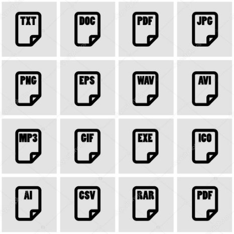

**Trabajar con Archivos - Namespace I-O**

**Evaluation Only. Created with Aspose.Words. Copyright 2003-2021 Aspose Pty Ltd.**

**Flujo de Entrada Flujo de Salida**

` `****

**Created with an evaluation copy of Aspose.Words. To discover the full versions of our APIs please visit: https://products.aspose.com/words/**

**System.IO - Clases**

`  `• Lee datos primitivos de una secuencia binaria   • Escribe datos primitivos en formato binario   • Edse  ubny taelsmacenamiento temporal para una secuencia   • Ayuda a manipular una estructura de directorio   • Se utiliza para realizar operaciones en directorios   • Proporciona información de las unidades de disco

`  `• Ayuda en la manipulación de archivos

`  `• Se utiliza para realizar operaciones en archivos

**Created with an evaluation copy of Aspose.Words. To discover the full versions of our APIs please visit: https://products.aspose.com/words/**

**System.IO - Clases**

`  `• Se usa para leer y escribir en cualquier ubicación de un 

archivo

`  `• eSen  ulat imlizeam poarriaa acceso aleatorio a datos almacenados   • aRrecahliizvao operaciones en la información de la ruta de un 

`  `• Se utiliza para leer caracteres de una secuencia de bytes

`  `• Se utiliza para escribir caracteres en una secuencia   • Se utiliza para leer desde un buffer de cadena   • Se utiliza para escribir en un buffer de cadena

**FileStream**

**Estructura Básica de FileStream**

**FileStream <nombre\_objeto> = new FileStream( <nombre\_archivo>, <Enumerador FileMode>,    <Enumerador FileAccess>, <Enumerador FileShare>);**

**Ejemplo de FileStream**

**FileStream F = new FileStream("ejemplo.txt", FileMode.Open, FileAccess.Read, FileShare.Read);**

**FileStream - Parámetros**

Append Read Inheritable Create ReadWrite None CreateNew Write Read

Open ReadWrite OpenOrCreate Write

Truncate

**Operaciones Básicas con Archivos y** 

**Directorios**

 

**Sistema de Ficheros de Windows**

**DirectoryInfo - Propiedades**

`  `• Obtiene los atributos del archivo o directorio actual   • aOcbttuiealne la hora de creación del archivo o directorio 

`  `• eOxbistiteene un valor booleano que indica si el directorio   • Obtiene la cadena que representa la extensión del 

archivo

`  `• Obtiene la ruta completa del directorio o archivo   • aOrbcthieivnoe o la d hiroercat oar iloa  aqcuteu asel accedió por última vez al 

`  `• Obtiene el nombre de esta instancia de DirectoryInfo

**DirectoryInfo - Métodos**

`  `• **public void Create ()**

- Crea un directorio

`  `•• **p**Cr**u**e**b**a **l**u**i**n**c****  s**D**u**i**b**r**d**e**ir**c**e**t**c**o**to**ry**ri** o**C** o**r** **e**su**a**b**t**d**e**i**S**re**u**c**b**to**d**ri**i**o**r**s**e** e**c**n**t** **o**la**r** r**y**u** t**(**a**s** **t**e**r**s**i**p**n**e**g**c** if**p**ic**a**a**t**d**h**a**)**. La ruta 

especificada puede ser relativa a esta instancia de la clase DirectoryInfo   • **public override void Delete ()**

- Elimina este DirectoryInfo si está vacío

`  `• **public DirectoryInfo [] GetDirectories ()**

- Devuelve los subdirectorios del directorio actual

`  `• **public FileInfo [] GetFiles ()**

- Devuelve una lista de archivos del directorio actual

**FileInfo - Propiedades**

`  `• Obtiene los atributos del archivo actual   • Obtiene la hora de creación del archivo actual

`  `• Obtiene una instancia del directorio al que pertenece el archivo   • Obtiene un valor booleano que indica si el archivo existe

`  `• Obtiene la cadena que representa la extensión del archivo   • Obtiene la ruta completa del archivo

`  `•Obtiene la hora a la que se accedió por última vez al archivo actual

` `• Obtiene la hora de la última actividad de escritura del archivo  • Obtiene el tamaño, en bytes, del archivo actual  • Obtiene el nombre del archivo

**Created with an evaluation copy of Aspose.Words. To discover the full versions of our APIs please visit: https://products.aspose.com/words/**

**FileInfo - Métodos **  • **public StreamWriter AppendText ()**

- Crea un StreamWriter que agrega texto al archivo representado por esta instancia de FileInfo

`  `• **public FileStream Create ()**

- Crea un archivo

`  `• **public override void Delete ()**

- Elimina un archivo de forma permanente

`  `• **public void MoveTo (string destFileName)**

- Mueve un archivo especificado a una nueva ubicación, brindando la opción de especificar un nuevo nombre de archivo

`  `• **public FileStream Open (FileMode mode)**

1. Abre un archivo en el modo especificado
6  • **public FileStream Open (FileMode mode, FileAccess access)**
   1. Abre un archivo en el modo especificado con lectura, escritura o acceso de lectura / escritura
6  • **public FileStream Open (FileMode mode, FileAccess access, FileShare share)**
   1. Abre un archivo en el modo especificado con lectura, escritura o acceso de lectura / escritura y la opción de compartir especificada
8  •• C**p**r**u**e**b**a**li** u**c** n**F** **i**F**le**il**S**e**t**S**r**t**e**r**a**e**m**am **O** d**p**e**e** **n**so**R**l**e**o**a** l**d**e** c**(**t**)**ura
8  • **public FileStream OpenWrite ()**
- Crea un FileStream de solo escritura

**Created with an evaluation copy of Aspose.Words. To discover the full versions of our APIs please visit: https://products.aspose.com/words/**
**La Clase Stream**

*** 

**Stream**

**FileStream MemoryStream BufferedStream NetworkStream PipeStream CryptoStream**

**Created with an evaluation copy of Aspose.Words. To discover the full versions of our APIs please visit: https://products.aspose.com/words/**
**Readers y Writers**
||
| - |
||

||
| :- |
||
**Cadena Lectura/Escritura Lectura/Escritura de bytes**

` `****
**

**Archivo Físico “prueba.txt”**

**Created with an evaluation copy of Aspose.Words. To discover the full versions of our APIs please visit: https://products.aspose.com/words/**

**StreamReader - Métodos**

- **public override void Close()**

` `• Cierra el objeto StreamReader y la secuencia subyacente, y 

libera todos los recursos del sistema asociados con las operaciones de lectura.

` `•• D**pu**e**b**vu**li**e**c** l**o**ve**ve** e**r**l**r** s**id**ig**e**u **i**i**n**e**t**n** t**P**e**e** **e**ca**k**r**(**á**)**cter disponible pero no lo 

consume

` `•• **p**Le**u**e**b** **l**e**ic**l**  s**o**ig**v**u**e**i**r**e**r**n**id**t**e**e**  **i**c**n**a**t**r** á**R**c**e**t**a**e**d**r **(**d**)**e la secuencia de entrada y avanza 

la posición del carácter en uno

**Created with an evaluation copy of Aspose.Words. To discover the full versions of our APIs please visit: https://products.aspose.com/words/**

**StreamWriter - Métodos**

`  `• **public override void Close()**

- Cierra el objeto StreamWriter actual y la secuencia subyacente

`  `•• **p**Bo**u**r**b**ra**li** **c**t** o**o**d**v**o**e**s**r** l**r**o**i**s**d** a**e**l** m**vo**a**i**c**d**e** n**F**a**lu**m**s**i**h**en**()**tos intermedios de la operación de escritura actual y 

hace que los datos almacenados en el búfer se escriban en el flujo subyacente

`  `•• **p**Es**u**c**b**r**l**i**i**b**c**e **v** l**i**a**rt** r**u**e**a**p**l**r **v**e**o**se**id**n **W**tac**r**i**i**ó**te**n**(** **b**d**o**e**o** t**l**e **v**x**a**to**lu** d**e**e**)** un valor booleano en la secuencia de 

texto o secuencia

` `• **public override void Write(char value)**

- Escribe un carácter en la transmisión

` `•• **p**Es**u**c**b**r**l**i**i**b**c**e **v** l**i**a**rt** r**u**e**a**p**l**r **v**e**o**se**id**n **W**tac**r**i**i**ó**te**n**(** **d**d**e**e**c** t**i**e**m**x**a**to**l**  **v**d**a**e**lu** u**e**n**)** valor decimal en la secuencia de texto 

o secuencia

**StreamWriter - Métodos**

- **public virtual void Write(double value)**

`  `• Escribe la representación de texto de un valor de coma flotante de 8 bytes en 

la secuencia de texto o secuencia

`  `•• **p**Es**u**c**b**r**l**i**i**b**c**e **v** l**i**a**rt** r**u**e**a**p**l**r **v**e**o**se**id**n **W**tac**r**i**i**ó**te**n**(** **i**d**n**e**t****  t**v**e**a**x**lu**to**e** **)**de un entero de 4 bytes con signo en la 

secuencia de texto o secuencia

`  `•• **p**Es**u**c**b**r**l**i**i**b**c**e **o** u**v**n**e**a**rr** c**id**a**e**d** e**v**n**o**a**id** e **W**n l**r**a**i** **t**s**e**e**(**c**s**u**tr**e**in**n**g**ci** a**value)**

` `• **public virtual void WriteLine()**

- Escribe un terminador de línea en la secuencia de texto o secuencia

**Trabajando con Archivos ZIP**

 **Compresión Ahorro en AlmacenamientoMenor Consumo de Red**

**Compresión - ZIP**

** 
**

||
| :- |
||
**Características- ZIP**

**  

**Trabajando con ZIP**

**ZipArchive**

**ZipArchive**

**ZipArchive**

 

**Created with an evaluation copy of Aspose.Words. To discover the full versions of our APIs please visit: https://products.aspose.com/words/**
