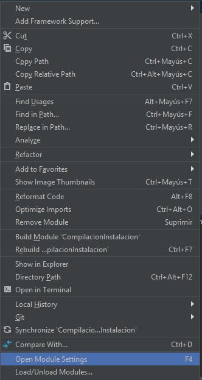
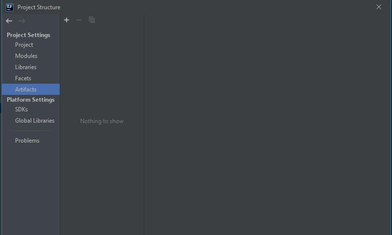
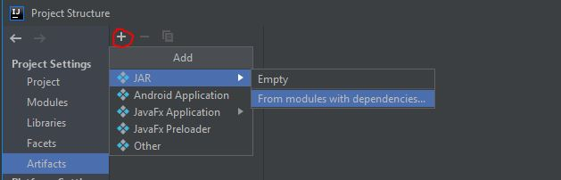
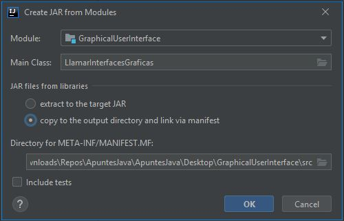
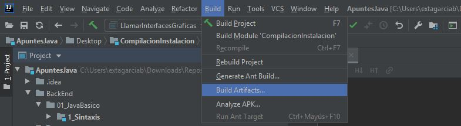
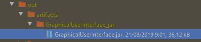

Primero Vamos a un modulo del proyecto, click derecho y `Open Module Settings`

Después nos aparecerá esta ventana en la que seleccionaremos Artifacts

Después le darémos al `+ > JAR > From modules with dependencies...`

Veremos esta ventana en la que:

- Module: Seleccionamos el modulo que queremos convertir en ``.jar``, si seleccionamos el All Modules se compilaran todos los módulos en `.Jar` independientes porque los jar se crean por modulo

- Main Class: Seleccionaremos la clase Main del modulo seleccionado

Después seleccionaremos la segunda opción y le daremos a Ok

Una vez guardados los cambios, si queremos compilar y por tanto, crear el JAR, `Build > Build Artifacts...`

Se guardará en esa ruta

Una vez realizado podremos ejecutar el Jar dándole doble click siempre que tengamos Java instalado en el equipo o con el comando ``java -jar archivo.jar``