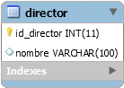

Haz un script en el que se introduzcan en un menú desplegable de un formulario los datos de los directores. Supón que la base de datos está alojada en local, el usuario y el password son “root” y la base de datos se llama “filmoteca”.

No hace falta que crees todo el código del formulario, basta con construir el menú desplegable.

Las llaves primarias de cada tabla se generan automáticamente.