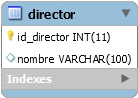

Crea una aplicación para dar de alta directores en la base de datos del ejercicio anterior.

Puedes hacer dos páginas, una con un formulario y otra en la que se inserte el nuevo director en la base de datos, o todo en una misma página, controlando que todo se ejecute cuando toca.