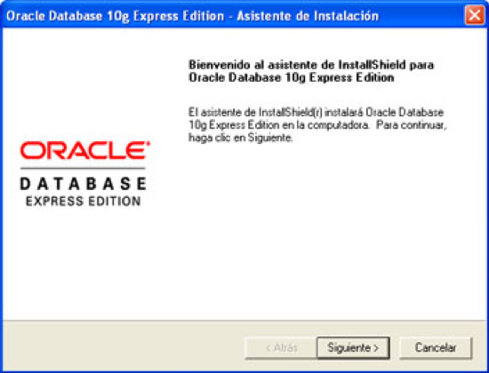
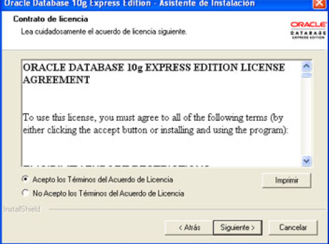
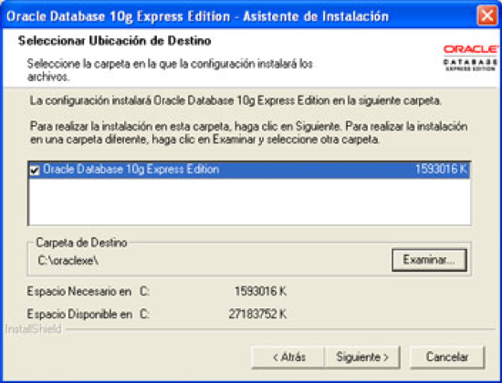
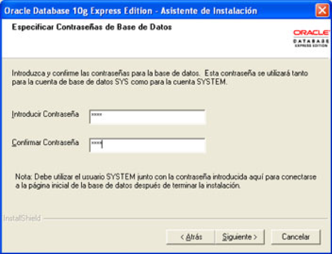
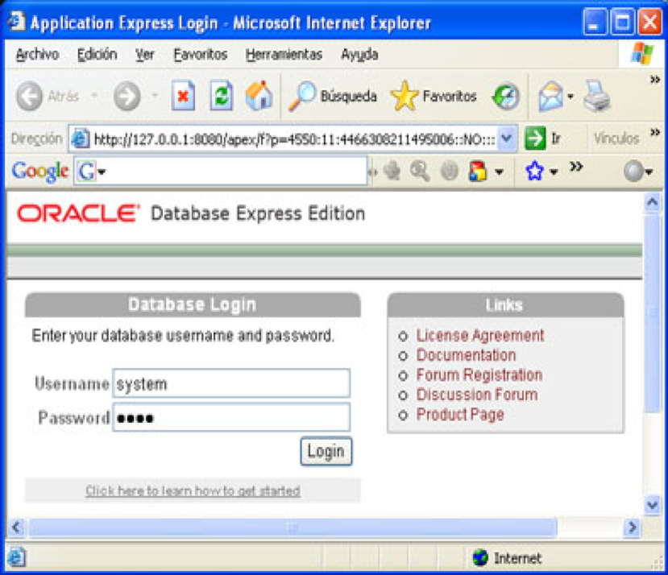
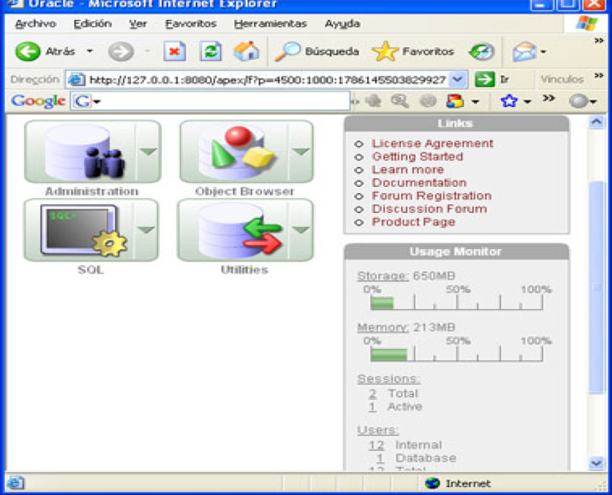
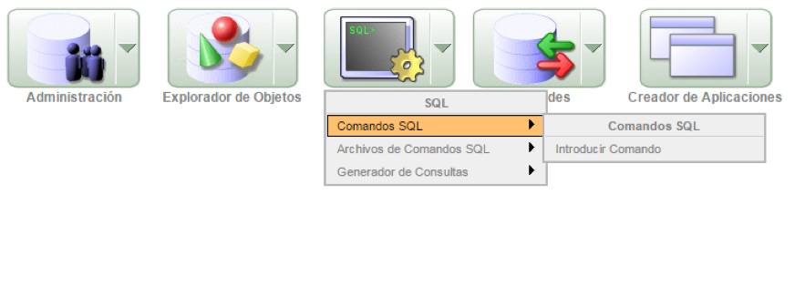
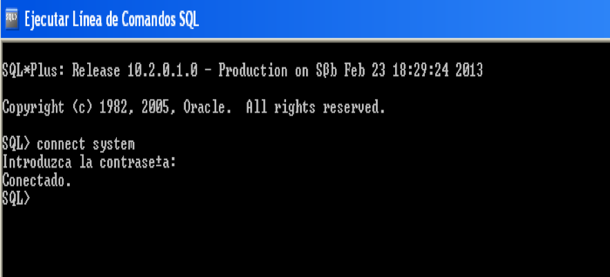
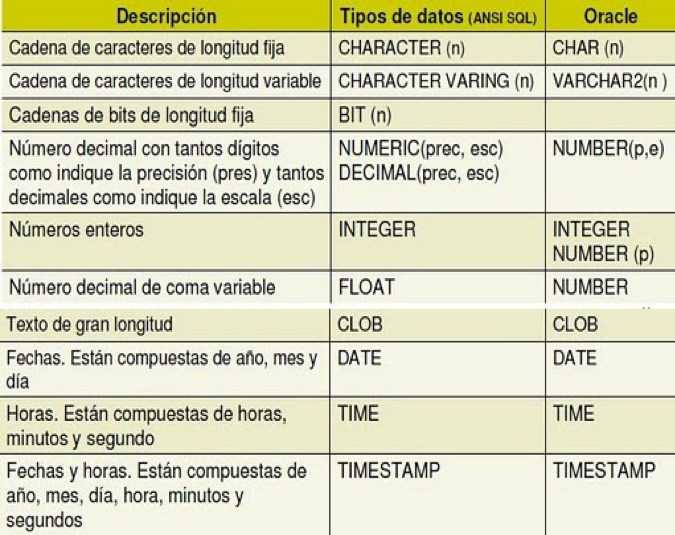

Oracle es una potente herramienta para la gestión de Bases de Datos

|   |
| --- |

 Es un producto vendido a nivel mundial, aunque la gran potencia que tiene y su elevado precio hace que sólo se vea en empresas muy grandes y multinacionales, por norma general.

Para desarrollar en Oracle utilizamos PL/SQL un lenguaje bastante potente para tratar y gestionar la base de datos.

**Instalar Oracle Database 10**** g **** XE Express Edition**

 

 

 

 Introduciremos la contraseña para el usuario _SYS_ y para el usuario _SYSTEM_ y pulsaremos _Siguiente_:

 

Los accesos directos que crea la aplicación:

| **Acceso directo** | **Descripción** |
| --- | --- |
| Introducción | Muestra una ventana de ayuda en formato html |
| Ir a Página Inicial de Base de Datos | Muestra la página de configuración y administración de Oracle |
| Parar Base de Datos | Detiene la base de datos |
| Realizar Copia de Seguridad de la Base de Datos | Copia de seguridad de la base de datos |
| Restaurar Base de Datos | Restaura una copia de seguridad de la base de datos |
| Obtener Ayuda | Ayuda |
| Ejecutar Línea de Comandos SQL | SQL\*Plus: Permite ejecutar comandos SQL y PL/SQL |
| Iniciar Base de Datos | Inicia la base de datos previamente detenida |

** **

Inicio/Base de Datos Oracle 10g Express Edition/Ejecutar Línea de Comandos SQL.

SQL\*Plus es un programa de linea de comandos de [Oracle](http://es.wikipedia.org/wiki/Oracle_database) que puede ejecutar comandos [SQL](http://es.wikipedia.org/wiki/SQL) y [PL/SQL](http://es.wikipedia.org/wiki/PL/SQL) de forma interactiva o mediante un script.

SQL\*Plus opera como una herramienta relativamente simple con una interfaz de lineas de comando básica. Los programadores y los administradores de bases de datos (DBA&#39;s) lo usan de forma muy común como interfaz fundamental en la mayoría de las instalaciones de software de Oracle.

Inicio/Base de Datos Oracle 10g Express Edition/Ir a Página Inicial de  Base de Datos

 

 

 

**SQL\*Plus**

Desde la herramienta SQL\*Plus podemos ejecutar distintos tipos de instrucciones:

- Instrucciones SQL
- Instrucciones PL/SQL
- Instrucciones SQL\*Plus

Instrucciones SQL

Hasta que no haya un ; no ejecuta la instrucción.

La instrucción puede estar escrita en una línea o en varias  el ; indica el final de la instrucción.

Instrucciones PL/SQL

Se utilizan cuando se crean procedimiento, funciones,…

Instrucciones SQL\*Plus

No llevan ;

sentencias como: connect, set, clear scr, desc,…

 

Crear un usuario:

create user nombre\_usuario identified by contraseña **;**

Conceder permisos al usuario creado:

grant dba to nombre\_usuario **;**

Para mostrar en qué usuario estamos: show user;

Cuando trabajamos con SQL\*Plus disponemos de un buffer de edición que contiene la última sentencia SQL que se escribió.

Para acceder al editor:  edit  es suficiente escribir ed

Visualizar el contenido del buffer: list es suficiente l

Para guardar las órdenes en un archivo :

 ed [path]nombre\_archivo.sql

Para ejecutar el contenido almacenado en el fichero .sql

start [path]nombre de fichero

Limpiar la pantalla: clear scr

Para crear vistas:

create view nombre de la vista as select……from…….

Borrar una vista: drop view nombre de la vista;

Oracle contiene cientos de vistas, los nombres de algunas de estas vistas son:

user\_views

user\_tables

user\_objects

user\_constraints

user\_tablespaces

Para saber la estructura de tablas o vistas:

desc  nombre de la tabla o nombre de la vista

ejemplos:

desc empleados;

desc user\_views;

select view\_name, text from user\_views;

select \* from user\_views;

Objetos del usuario:

user\_tablespaces, user\_tables, user\_objects, user\_constraints,…

Todos los objetos:

all\_tables, all\_constraints,sys.all\_cons\_columns ésta vista nos muestra las reglas de integridad y columna a la que afectan.

Para modificar el número de caracteres de una línea: set  linesize nº

Para modificar el número de líneas de una página: set  pagesize nº

Para saber la estructura de los objeto escribiremos:

desc user\_objects

select substr(object\_name,1,15) &quot;nombre de la vista&quot;, object\_type from user\_objects;

Eliminar una columna o campo de una tabla:

Alter table nombre\_tabla drop column nombre\_columna;

Modificar el tipo de datos y longitud de un campo:

Alter table nombre\_tabla modify nombre\_columna;

**Tipos de datos**

 

Tipos de datos más usados: varchar2(), date , number(n,d)

Datos varchar2() y date se escriben entre &#39;    &#39;

number(6,2) 1234.56

**Tablespaces**

Un tablespace es una unidad lógica de almacenamiento dentro de una base de datos oracle.

Es un puente entre el sistema de ficheros del sistema operativo y la base de datos.

Cada tablespace se compone de, al menos, un datafile y un datafile solo puede pertenecer a un tablespace.

Cada tabla o indice de oracle pertenece a un tablespace, es decir cuando se crea una tabla o indice se crea en un tablespace determinado.

create tablespace  nombre del tablespace  datafile &#39;[path] nombre del fichero&#39; size  entero m;

entero es un número m significa Megas. Se refiere al tamaño del fichero (del datafile).

Ejemplo:

create tablespace empresa datafile &#39;c:\carpeta\datos&#39; size  5M;

Las carpetas deben de estar creadas antes de crear el tablespaces.

El tablespace se llama empresa.

El fichero se llama datos y está en la carpeta llamada carpeta.

**Tablas**

create table nombre de la tabla

(nombre columna…..

…..

…..

restricciones de tabla) tablespace nombre del tablespace;

\*\* En Oracle no se puede poner ON UPDATE CASCADE

Los nombres de los campos no se pueden separar con el carácter guión, si se puede poner guión bajo.

Utilización de comillas simples y dobles en Oracle:

select \* from empleados where provincia=&#39;Bizkaia&#39;;

select nombre as &quot;Nombre del Empleado&quot; from empleados;

Para realiza una copia  de estructura y datos, no copia primary keys, foreign keys,…

create table nombre de la tabla

as

select \*

from  nombre tabla a copiar;

Para crear vistas de tablas de otros usuarios hay que dar permiso sobre las tablas:

grant all on nombre de la tabla to nombre del usuario;

Cambiar de nombre a una tabla:

rename nombre anterior de la tabla to nombre nuevo;

Cambiar el nombre de una columna:

alter table nombre de la tabla rename column nombre anterior to nombre nuevo;

# **Sentencia INSERT**

Añade filas a una tabla.

Para guardar los datos insertados hay que ejecutar [COMMIT](http://ora.u440.com/dml/commit.html);

Para cancelar la inserción podemos hacer [ROLLBACK](http://ora.u440.com/dml/rollback.html);

Un formato posible es:

INSERT INTO nombre-tabla

VALUES (serie de valores)

El orden en el que se asignen los valores en la cláusula VALUES tiene que coincidir con el orden en que se definieron las columnas en la creación del objeto tabla, dado que los valores se asignan por posicionamiento relativo.

Por ejemplo:

INSERT INTO T\_PEDIDOS

VALUES (125,2,&#39;PEPE&#39;);

Otra forma de usar la sentencia INSERT es:

INSERT INTO nombre-tabla (columna1, columna2.....)

VALUES (valor1, valor2....)

En este caso los valores se asignarán a cada una de las columnas mencionadas por posicionamiento relativo.

Es necesario que por lo menos se asignen valores a todas aquellas columnas que no admiten valores nulos en la tabla (NOT NULL).

Por ejemplo:

INSERT INTO T\_PEDIDOS (CODPEDIDO,ESTADO)

VALUES (125,2);

# **Sentencia INSERT de múltiples filas**

Para insertar un subconjunto de filas de una tabla en otra se escribe una sentencia INSERT con una SUB[SELECT](http://ora.u440.com/dml/select.html) interna. Los formatos posibles son:

INSERT INTO nombre-tabla (columna1, columna2.....)

[SELECT](http://ora.u440.com/dml/select.html) ([sentencia Select])

Asigna a las columnas los valores recuperados en la sentencia Select. Inserta en la tabla todas las filas que se recuperen en la Select.

Por ejemplo:

INSERT INTO T\_PEDIDOS (CODPEDIDO,ESTADO,NOMBRE)

[SELECT](http://ora.u440.com/dml/select.html) CODPEDIDO+100,ESTADO,NOMBRE FROM T\_PEDIDOS [WHERE](http://ora.u440.com/dml/where.html) CODPEDIDO IN (1,2,3);

Otra forma es:

INSERT INTO nombre-tabla [SELECT](http://ora.u440.com/dml/select.html) \* FROM nombre-tabla-fuente

En este caso las estructuras de las tablas tienen que ser iguales.

Este ejemplo copia hasta el pedido 100 en otra tabla:

INSERT INTO T\_PEDIDOS\_BAK

[SELECT](http://ora.u440.com/dml/select.html) \* FROM T\_PEDIDOS [WHERE](http://ora.u440.com/dml/where.html) CODPEDIDO\&lt;100;

Ambas tablas son iguales.

# **Sentencia UPDATE**

Actualiza valores de una o más columnas para un subconjunto de filas de una tabla.

Para guardar cambios hay que ejecutar [COMMIT](http://ora.u440.com/dml/commit.html);

Para cancelar la modificación podemos hacer [ROLLBACK](http://ora.u440.com/dml/rollback.html);

UPDATE nombre-tabla

[SET](http://ora.u440.com/plsql/set.html) columna1 = valor1 [, columna2 = valor2 ...]

[[WHERE](http://ora.u440.com/dml/where.html) condición]

Actualiza los campos correspondientes junto con los valores que se le asignen, en el subconjunto de filas que cumplan la condición de selección.

Si no se pone condición de selección, la actualización se da en todas las filas de la tabla.

Si se desea actualizar a nulos, se asignará el valor NULL.

En este ejemplo cambiamos el nombre y estado de un pedido:

UPDATE T\_PEDIDOS

[SET](http://ora.u440.com/plsql/set.html) NOMBRE=&#39;JUAN&#39;,ESTADO=1

[WHERE](http://ora.u440.com/dml/where.html) CODPEDIDO=125;

En este ejemplo cambiamos el estado de todos los pedidos:

UPDATE T\_PEDIDOS

[SET](http://ora.u440.com/plsql/set.html) ESTADO=1;

En este ejemplo ponemos a nulo el nombre de un pedido:

UPDATE T\_PEDIDOS

[SET](http://ora.u440.com/plsql/set.html) NOMBRE=NULL

[WHERE](http://ora.u440.com/dml/where.html) CODPEDIDO=125;

# **Sentencia DELETE**

Borra una o más filas de una tabla, dependiendo de la condición [WHERE](http://ora.u440.com/dml/where.html).

Para guardar cambios hay que ejecutar [COMMIT](http://ora.u440.com/dml/commit.html);

Para cancelar el borrado podemos hacer [ROLLBACK](http://ora.u440.com/dml/rollback.html);

La sintaxis es la siguiente:

DELETE FROM nombre-tabla

[[WHERE](http://ora.u440.com/dml/where.html) condición]

CUIDADO! Si no se pone condición de selección, borra todas las filas de la tabla.

Si ejecutamos:

DELETE FROM T\_PEDIDOS;

Borrar toda la tabla.

Si ejecutamos:

DELETE FROM T\_PEDIDOS [WHERE](http://ora.u440.com/dml/where.html) COD\_PEDIDO=15;

Borrar un registro.