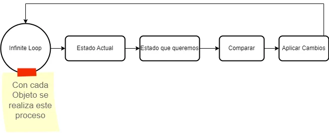

Es una tecnologia nacida en Google, que es de código abierto y el objetivo es facilitar los deploys de las aplicaciones, automatizando todo el proceso basandose en una serie de instrucciones que nosotros le adjuntamos a traves de un fichero de configuración.

La idea de kubertenes es la de desplegar la aplicacion en un cluster a traves de contenedores optimizando y buscando la mejor reparticion de recursos del cluster para obtener los mayores beneficios posibles en terminos de necesidades, escalabilidad, rendimiento y precio.

Para poder cumplir con ese objetivo de maxima utilizacion y de abstracción del cluster de cara al usuario, kubernetes modela el ciclo de vida de las aplicaciones.
> Cuando se habla del ciclo de vida de una aplicacion se refiere a todos los procesos desde crear, desplegar, escalar, monitorizar, recursos de CPU, Memoria, etc.

Para poder hacer todo este proceso de una forma sencilla y eficaz, kubernetes dispone de un lenguaje común donde, a traves de un API, nosotros podemos declarar como queremos que se realice ese ciclo de vida de nuestras aplicaciones.

Nuestro objetivo es tener unas configuraciones declarativas donde configuraremos si una aplicacion depende de otras, cuantos recursos de CPU, memoria, número de instancias, etc. y cuando tengamos eso, lo enviamos a Kubernetes a traves de ese API y de forma totalmente asincrona, kubernetes lee la declaracion y realiza las acciones necesarias para cumplir lo que se necesita
> Un depliegue con kubernetes puede tardan varios minutos, puesto que se realiza de forma async y cuando va encontrando recursos donde alojar lo que solicitamos

En las especificaciones declarativas nuestras indicamos lo siguiente:
- **kind**: Indica el tipo de objeto
- **apiVersion**: La estructura de los objetos esta versionada, aqui se indica cual queremos
- **metadata**: Establecemos informacion referia al objeto, nombre, etiquetas, etc.
- **spec**: Indicamos la declaracion del ciclo de vida de la aplicación(como queremos que quede el objeto)
- **status**: Estado actual del objeto en el cluster

# Bucle de Reconciliación
Para todo el proceso de leer la configuracion que enviamos y realizar las acciones que sea necesarias, kubernetes usa un proceso llamado **bucle de reconciliacion**

> El bucle de reonciliacion kubernetes los esta ejecutando siempre sobre todos los objetos que tiene, de esta forma, cuando encuentra que hay cambios de estado, los va aplicando

El bucle de reconciliacion consite en el siguiente proceso:


Tenemos un bucle infinito en el que se obtiene el estado actual del objeto, el estado que queremos(el que enviamos), se comparan y si hay diferencias, se van aplicando cambios y vuelta a empezar.

Este proceso del bucle de reconciliacion no lo tiene solo 1 servicio, sino que kubernetes por debajo tiene muchos servicios independientes los cuales se van encargando de diferentes partes, por eso el despliegue no es instantaneo.

# Pods
En kubernetes cuando queremos crear y desplegar una aplicacion necesitamos crear un `pod`.

Un pod es un conjunto de contenedores y de volumenes de datos que van a componer la aplicacion

> Un pod es como el equivalente a un contenedor de docker, pero en el caso de kubertenes un pod puede tener mas de un contendor, por ejemplo, si nuestra aplicacion tenemos sistemas de conversion de logs, temas de seguridad, etc. En vez de meterlo todo en la imagen de nuestra aplicacion de base, podemos fragmentarlo en diferentes containers dentro del mismo pod para tener mas separación

Cuando nosotros ejecutamos aplicaciones en docker, cada contenedore de docker, usa los `cgroups` de Linux para limitar lo que cada contenedor puede ver(nerworking, procesos, disco, etc.)

> Todos esos contendores dentro de un poc de kubernetes, todos comparten el mismo namespace de networking, por tanto, podran lanzar una consulta a localhost y podran conectar entre si

La direccion ip que reciben los pod es privada, eso significa que no se puede acceder desde fuera del cluster, por tanto no podemos enviar una peticion a esa aplicacion desde mi ordenador. En cambio, si que pueden ser accedidas desde otros pods(porque estan en el mismo cluster)

El pod es la unidad de recursos mas pequeñas que puedo crear en kubernetes, si quiereo ejecutar un contendor en kubernetes, tengo que hacer uso de un pod.

Kubertenes me permite una abstraccion del cluster y de la infraestructura y ya no hay que pensar en servidores individuales, aunque haya varias instancias, la idea es que pienses como si fuera 1 solo
> Si tienes 10 instancias con 4 cores y 16GB de RAM, hay que pensar como si esa aplicacion tuviera 40 cores y 160GB de RAM, todo en conjunto, no por separado

Cuando creamos un pod, necesitamos especificar que recursos va a necesitar. Kubernetes va a intentar colocar teniendo en cuenta lo que el pod necesita de recursos con los recursos disponibles dentro del cluter, evalue si hay sitio y si es asi, lo coloca.

> Puede ser que varias aplicaciones acaben en el mismo servidor, pero es totalmente transparente para nosotros

Cada pod tiene su propio ciclo de vida y puede ser escalado de forma independiente.

Como consejo es no poner dentro de ese pod varias aplicaciones, intentar que sean lo mas separadas posibles, puesto que si necesitas escalar o incluso matar una aplicacion, tendrias que hacerlo sobre el pod y eso afectaria al conjunto de aplicaciones de ese pod.

## Estructura de un POD

Si queremos generar una estrucutra por donde empezar, podemos ejecutar un comando como el siguiente: `kubectl run prueba --image=nginx:latest --restart=Never --port=8080 --dry-run -o yaml`

> Este es un comando que podemos ejecutar y en realidad enviaria a la api la solicitud para hacer el deploy, pero con el tag `--dry-run` lo que indicamos es que ejecute a modo de prueba y que no lo envie

> Para obtener los pod, ejecutamos el comando `kubectl get pods`

```yml
apiVersion: v1
kind: Pod
metadata:
  name: nginx
  labels:
    app: nginx
    tier: backend
spec:
  containers:
  - name: my-nginx
    image: nginx:1.13
    ports:
    - containerPort: 8080
    env:
    - name: VARIABLE_ENTORNO
      value: "2324" 
    - name: VARIABLE_ENTORNO_2
      value: "prueba de variable de entorno"
    resources:
      limits: # cantidad maxima requerida
        cpu: 50m
        memory: 32Mi
      requests: # cantidad minima requerida
        cpu: 50m
        memory: 32Mi
    livenessProbe:
      httpGet:
        path: /
        port: http
    readinessProbe:
      httpGet:
        path: /
        port: http
    restartPolicy: Never
```
Esta es la expresion declarativa en un fichero `yaml` que tenemos que enviar a kubernetes, el comando seria el siguiente `kubectl create -f pod.yaml`.

- **kind**: Indicamos que es un pod
- **metadata**
    - **labels**: Podemos indicar lo que queramos, por ejemplo, el grupo al que pertenece la app, el equipo, etc.
    - **name**: Este refiere al nombre del pod y no se puede repetir
- **spec**
    - **name**: Nombramos el contenedor del pod
    - **image**: Indicamos la imagen que queremos desplegar en el contenedor
    - **ports**: Indicamos el puerto donde queremos ejecutar la app
    - **env**: Se usa para indicar una lista de variables de entorno con `name` y `value`
    - **resources**: Para indicar los recursos minimos y maximos que tiene que usar el pod, si se deja en blanco es equivalente a recursos ilimitados(**NO Recomendable**)
        - **limits**: Cantidad de recursos maximos que el pod puede llegar a consumir.
        - **requests**: El pod será colocado en algún nodo donde como mínimo haya esa cantidad de recursos, si no hay disponible esos recursos, no se creará el pod.
    - **livenessProbe**: Indicamos la ruta donde kubernetes puede comprobar que el api esta funcionando correctamente. Si detecta fallo, kubernetes intentará resolverlos reiniciando el contenedor.
    - **readinessProbe**: Establece si el contenedor esta preparado para recibir tráfico. Si este falla, kubernetes sacará este pod del servicio para que no reciba peticiones hasta que este operativo de nuevo.
    - **restartPolicy**: Definimos que queremos que haga kubernetes si el pod muere, por ejemplo, por un error

### Cálculo de Recursos
Para indicar los recursos que necesitamos como la CPU o la memoria, necesitamos establecer los valores de formas concretas

- **Memoria**: La memoria se especifica en bytes, y puedes utilizar las unidades como Mi o Gi para simplificar la lectura y escritura. La conversión es la siguiente:
    - **1 Mi** = 2^20 bytes = 1,048,576 bytes
    - **1 G** = 2^30 bytes = 1,073,741,824 bytes
- **CPU**: Los valores para la CPU se especifican en *millicpus*, por lo que **1000m** representa un núcleo completo.
    - **0.5**: Representa lo mismo que **500m**, que seria medio núcleo

### Opciones para los healthcheck
Para establacer los healthcheck podemos indicar varias formas de hacer esa comprobacion. La normal suele ser la `http`, pero tambien podemos establecer otras formas como ejecutar un comando dentro del container

- **httpGet** Establece una conexion por HTTP, si no devuelve un codigo entre 200-399 será marcado como error.
    - **path**: Indicamos la ruta de la peticion HTTP donde consultar el health
    - **port**: Indicamos el puerto donde se tiene que conectar(se puede indicar los puertos por nombre, http = 80)
- **tcpSocket**: Intenta establecer una conexión por socket TCP
    - **port**
- **exec**: Ejecuta un comando a nivel del contenedor
    - **command**
- **initialDelaySeconds**: Tiempo que espera antes de realizar el primer check
- **periodSeconds**: Intervalo de tiempo entre checks *El valor por defecto son 10s*
- **timeoutSeconds**: El tiempo que hay que esperar antes de darlo por fallido
- **successThreshold**:  El mínimo de checks antes de considerar que esta correcto
- **failureThreshold**: El numero de checks que indican que esta muerto


# Persistencia
Los pods, igual que pasa en docker, cuando son destruidos toda la información que contienen tambien lo es.
Cuando montas un pod nuevo, se construye todo dede 0 en base a la imagen del contenedor que queremos.

Si queremos alojar en un pod por ejemplo, una bbdd y ese pod es destruido por lo que sea, se perderan todo los datos alojados, para evitar eso, en kubernetes tenemos el concepto de `volumes`

Un **volume** es un directorio reservado para ese pod y los container(del pod) que lo referencian.

> En un volume indicamos un path dentro del container que queremos persistir y toda la informacion de ese path sera accesible desde un directorio reservado en el disco duro del cluster

> Como volumen tambien podemos configurar algunos concretos del cloud donde estemos, por ejemplo, *awselasticblockstore*, *azuredisk*, etc.

## Empty Dir
Un volumen **emptyDir** es un almacenamiento que se usa durante el ciclo de vida del pod, es util si la informacion que se va a almacenar no es importante que se persista y puede que queramos compartirla entre containers del pod.

Agregamos la siguiente configuracion relativa al pod
```yaml
spec:
  containers:
    volumeMounts:
    - name: k8svolume
      mountPath: /tmp/
  volumes:
  - name: k8svolume
    emptyDir: {}
```

## State Persistence
Si queremos persistir datos en kubernetes para que, cuando el pod sea eliminado, no se pierdan hay que definir unos objetos de tipo  **PersistentVolume(PV)** o **PersistentVolumeClaim(PVC)**

### PersistentVolume
Representa un recurso de almacenamiento

```yaml
apiVersion: v1
kind: PersistentVolume
metadata:
  name: mipv
spec:
  storageClassName: local-storage
  capacity:
    storage: 1Gi
  accessModes:
    - ReadWriteOnce
  hostPath:
    path: "/mnt/data"
```

- **storageClassName** Nombre de la clase de almacenamiento a la que pertenece el PV
- **capacity**  La cantidad de almacenamiento que necesitamos
  - **storage**
- **accessModes** indicamos el modo que queremos que se acceda a los datos(lectura/escritura)
  - **ReadWriteOnce (RWO)** El volumen puede ser montado como lectura-escritura por un solo nodo.
  - **ReadOnlyMany (ROX)** El volumen puede ser montado como solo lectura por múltiples nodos.
  - **ReadWriteMany (RWX)** El volumen puede ser montado como lectura-escritura por múltiples nodos.
- **hostPath** Utiliza el sistema de archivos local del nodo para el almacenamiento
  - **path** Ruta en el sistema de archivos del nodo


### PersistentVolumeClaim
Es una capa de abstraccion entre el **PV** y el pod

```yaml
apiVersion: v1
kind: PersistentVolumeClaim
metadata:
  name: mipvc
  namespace: paradigma
spec:
  storageClassName: local-storage
  accessModes:
    - ReadWriteOnce
  resources:
    requests:
      storage: 512Mi

```
- **storageClassName** Nombre de la clase de almacenamiento a la que pertenece el PV
- **capacity**  La cantidad de almacenamiento que necesitamos
  - **storage**
- **accessModes** indicamos el modo que queremos que se acceda a los datos(lectura/escritura)
  - **ReadWriteOnce (RWO)** El volumen puede ser montado como lectura-escritura por un solo nodo.
  - **ReadOnlyMany (ROX)** El volumen puede ser montado como solo lectura por múltiples nodos.
  - **ReadWriteMany (RWX)** El volumen puede ser montado como lectura-escritura por múltiples nodos.
- **resources** Indicamos los recursos de almacenamiento que necesitamos
  - **requests** Solicitamos el almacenamiento que necesitamos
    - **storage**: 

Como se ha comentado, esto es una solicitud mas a kubernetes como podia ser un `service` o un `deployment`, etc. Y es para solicitar espacio en disco.

El **PVC** se vincula con el recurso **PV** a traves de el **storageClassName** y el **AccessMode**, por tanto una vez creamos el PV y el PVC con el comando `kubectl apply -f archivo.yml` 

> El **storage-class** es la referencia del almacenamiento, `local-storage` es el sistema gestionado por kubernetes para usar el almacenamiento en el nodo local.

Una vez creados ambos recursos, tanto el volumen de persistencia, como el claim, establecemos la referencia en el pod de la siguiente forma:

```yaml
spec:
  containers:
    volumeMounts:
    - mountPath: "/mnt/storage"
      name: mivolume
  volumes:
  - name: mivolume
    persistentVolumeClaim:
      claimName: mipvc
```
- **persistentVolumeClaim** para hacer la referencia al PVC a que se tiene que conectar el pod
  - **claimName** el nombre del PVC que hemos establecido

> Es **IMPORTANTE** tener en cuenta que aunque esta solucion es interesante, si guardamos en `local-storage` y el nodo por lo que sea muere, los datos se perderían.

> Es **IMPORTANTE** tener en cuenta, que si usamos un deployment con varias replicas, si almacenamos con el `local-storage`, el almacenamiento no es compartido por nodos, por tanto las replicas no tendrian acceso a los mismos datos


# Config Maps
Nos permiten almacenar valores de configuración como una coleccion de parejas clave/valor

Podemos acceder a los valores de los configMaps de varias formas
- Pasandolo a la aplicacion como variables de entorno
- Poniendo diferentes claves dentro del contenedor. Cada clave sera un fichero distinto
- Pasandolo a la aplicacion como arguments de líne a de comandos

## Estructura de un ConfigMap
Para generar un nuevo configmap podemos usar el comando `kubectl create configmap example-config --from-literal=example.property1=hello`

Para listar los configmaps `get configmaps` y para leerlo `get configmaps special-config -o yaml`

```yaml
kind: ConfigMap
apiVersion: v1
metadata:
  name: example-config
Data:
  someValue: "23"
  example.property1: hello
  example.property2: world
  example.file: |-
    server {
      localtion / {
        root /data/www;
      }
    }
```
- **Data**: Le podemos pasar una lista de valores a tener, incluso le podemos guardar un fichero entero como en el ejemplo, el caso de `example.file`

> Como recomendacion usar siempre el formato de los contenidos en tipo `string`

## Configmaps como Variables de entorno
Para consumir los configmap desde un pod, basandonos en el pod anterior, eliminariamos los `value` alojados en las `spec.env` y referenciamos al configmap

```yaml
spec:
  env:
  - name: SOME_VARIABLE
    valueFrom:
      configMapKeyRef:
        name: example-config
        key: someValue
  - name: PROPERTY_1
    valueFrom:
      configMapKeyRef:
        name: example-config
        key: example.property1
  - name: PROPERTY_2
    valueFrom:
      configMapKeyRef:
        name: example-config
        key: example.property2
```

Si queremos pasar como variables de entorno todas las key del ConfigMap, sin tener que especificarlas en el pod podemos usar el tag `spec.envFrom` en sustitucion con `spec.env` e indicar los configmap a los que hacemos referencia
```yaml
spec:
  envFrom:
  - configMapRef:
      name: example-config
```

> Si el configmap esta creado, cuando ejecutemos la aplicacion, se aplicará el configmap correspondiente, segun entorno

> Si queremos comprobar que las variables tienen el contenido que queremos, podemos, acceder al container del pod mediante el comando `kubectl exec -it nombre-container -- /bin/bash` y dentro de la terminal y ejecutamos `env` para comprobar que estan y sus valores.

## Configmaps como ficheros en Volumes
Podemos usar un configmap para consumir sus valores en `volumes` indicandolo en el pod

```yaml
spec:
  container:
    volumeMounts:
    - name: config-volume
      mountPath: /tmp
  volumes:
  - name: config-volume
    configMap:
      name: nginx-conf #Referencia al nombre del configmap
```
- **container**
  - **volumeMounts**
    - **name**: Nombre del volumen
    - **mountPath**: El path dentro del contenedor donde se va a asignar el volumen
- **volumes**
  - **name**: Nombre del volumen al que hacemos referencia(el del contendor)
  - **confiMap**: Indicamos que nos vamos a basar en un configmap
    - **name**: Nombre del confimap al que hacemos referencia

> Para comprobar este caso podemos ejecutar el comando `kubectl exec -it nombre-pod -- cat /tmp/nginx.conf`


# Secrets
Son parecidos a los `config maps`, pero se almacenan codificados en base64

Podemos acceder a los datos de los Secret usando el tipo Volumen Secret.

Los secretos se almacenan en volumenes temporales *tmpfs* y nunca llegan a escribir en los discos de los nodos del cluster

Cada elemento de un Secret se guarda en un fichero distinto en el punto de montake especificado en el volumen

## Estructura de un Secret
Para generar un nuevo configmap podemos usar el comando `kubectl create secret generic test-secret --from-literal=username='admin' --from-literal=password='123456'`

Para obtener la lista ejecutamos `get secrets` y para leerlo `get secrets test-secret -o yaml`

> En la base de datos de kubernetes y dentro del cluster si que estan cifrados los secretos y no se pueden obtener, pero si hay acceso a kubectl, se puede leer perfectamente, para evitar esto lo recomedable es usar aplicaciones como `Vault` de hashicorp

```yaml
kind: Secret
apiVersion: v1
metadata:
  name: test-secret
type: Opaque
data:
  username: YWRtaW4
  passowrd: MWYyZDFlM
```
- **data**: se hace de la misma forma que con configmaps, pero en este caso los valores esta codificados en base64

## Secrets como Variables de entorno
```yaml
spec:
  env:
  - name: USERNAME
    valueFrom:
      secretKeyRef:
        name: test-secret
        key: username
  - name: PASSWORD
    valueFrom:
      secretKeyRef:
        name: test-secret
        key: password
```

Para pasar todas las key y values del secret, podemos referenciarlo directamente
```yaml
spec:
  envFrom:
  - secretRef:
      name: test-secret
```

## Secrets como Ficheros
```yaml
spec:
  container:
    volumeMounts:
    - name: config-volume
      mountPath: /etc/carpetaSecreta
  volumes:
  - name: config-volume
    secret:
      secretName: test-secret #Referencia al nombre del secret
```

> Cuando creamos el fichero de esta forma, se crea 1 fichero por cada key dentro del configmap o secret y el contenido esta en claro


# Services
Por defecto las direcciones que reciben los pods estan limitadas al cluster privado, no se puede acceder desde fuera.

Un service nos da una direccion accesible y estable para poder enviar peticiones a los contenedores alojados en kubernetes.

> El service nos permite abstraer un conjunto de pods iguales tras la misma direccion(parecido a un load balancer)

Cuando se crea un Service kubernetes crea un objeto(mediante el bucle de reconciliacion) **Endpoint** que contendra las IPs de los Pods que esten vivos.

Para relacionar un pod con un service, se hace uso del campo de **metadata**, donde indicamos el mismo nombre que el que tiene el pod al que hacemos referencia.

## Estructura de un Service
> Para generar un archivo base de service podemos usar el comando `kubectl expose pod/nombrePod --port 80 --dry-run -o yaml`

> Para consultar los services que tenemos `kubectl get services`

```yaml
apiVersion: v1
kind: Service
metadata:
  name: nginx-service
spec:
  selector:
    app: nginx
    tier: backend
  ports:
    - protocol: TCP
      port: 80
      targetPort: 80
  type: LoadBalancer
```

- **kind**: Indicamos que queremos un Service
- **metadata**
    - **name**: El nombre que vamos a declarar al Service 
- **spec**: La especificacion de que va a hacer el service
    - **selector** Es la forma que tenemos de decirle al Service que PODS tienen que estar detras de este service, se basa en los labels del metadata configurado en los pods
    - **ports**
        - **protocol**: Protocolo de comunicación que recibe
        - **port**: El puerto que escucha el service dentro del cluster
        - **targetPort**: El puerto en el contenedor donde se dirige el trafico
        - **nodePort**: Indicamos el puerto desde el que queremos que el servicio sea accesible con el tipo **NodePort**, esto es útil si queremos definir nuestro load balancer aparte(por ejemplo, con un proveedor como cloudflare)
    - **Type**: indicamos el tipo de service, si no indicamos nada se establecera por defecto `ClusterIP` 
        - **ClusterIP**: El Service obtiene una IP estable(no cambia) que solo es accesible desde otros PODS ejecutandose dentro del cluster, no se puede acceder desde fuera
        - **NodePort**: En todos los nodos del cluster va a estar expuesto un puerto y las peticiones hacia `<IP-Nodo>:<Puerto>` del cluster, se accederá al pod correspondiente. El puerto al que tenemos que acceder se genera aleatoriamente o podemos indicarlo en el parametro `spec.ports.nodePort`, lo reocmendable es utilizar un puerto entre 30000-32767
        - **LoadBalancer**: Solicita al proveedor de cloud correspondiente la creacion y configuracion de un `Load Balancer`, este tendra una direccion accesible desde fuera y este se encargará de mandar el tráfico internamente a los pods que corresponda. **Es parecido a un NodePort, pero con la lógica de balancear la carga**
 
> Para interconectar servicios dentro del cluster, igual que en docker, podemos indicar el nombre del pod correspondiente, para probar que funciona, podemos ejecutar el comando `kubectl run --rm -i --tty my-client-app --image=alpine --restart=Never -- sh` para simular una terminal y lanzar un `curl -i nginx` contra el nombre o IP del pod correspondiente


# Deployment
Los Pods están atados al ciclo de vida del nodo donde se están ejecutando. Si ese nodo desaparece, el pod desaparecerá con él.

Se pueden usar los Deployments para asegurarnos de que un pod siempre esté vivo, aunque un nodo falle(gracias al bucle de reconciliacion).

> Para generar un archivo deployment podemos usar el comando `kubectl run prueba --image=nginx:latest --port=8080 --dry-run -o deployment.yaml`

> Para obtener un listado de los objetos de tipo deployment ejecutamos `kubectl get deployments`

## Estructura de un Deployment
```yml
apiVersion: apps/v1
kind: Deployment
metadata:
  name: nginx-deployment
spec: # Define cuantos pods tienen que estar vivos
  replicas: 1
  selector:
    matchLabels:
      app: nginx
  template:
    metadata:
      labels:
        app: nginx
    spec: # Define el POD
    containers:
    - name: my-nginx
        image: nginx:1.13
        ports:
        - containerPort: 8080
        resources:
        limits: # cantidad maxima requerida
            cpu: 50m
            memory: 32Mi
        requests: # cantidad minima requerida
            cpu: 50m
            memory: 32Mi
        livenessProbe:
        httpGet:
            path: /
            port: http
        readinessProbe:
        httpGet:
            path: /
            port: http
```
Esta es la expresión declarativa en un fichero `yaml` que tenemos que enviar a kubernetes, el comando seria el siguiente `kubectl create -f pod.yaml`.

- **kind**: Indicamos que va a ser de tipo deployment
- **metadata**
    - **name**: Este refiere al nombre del pod y no se puede repetir
- **spec**: Definimos los minimos de deployment
    - **replicas**: Indicamos el numero de replicas(instancias) que siempre tiene que tener nuestra app
    - **selector**: Establecemos la forma en la que vamos relacionar los deployment con los pods y los services
        - **matchLabels**: La forma de relacionar los deployment con el pod
    - **template**: Indicamos la misma configuracion que teniamos anteriormente relativa al POD

Esta es la expresion declarativa en un fichero `yaml` que tenemos que enviar a kubernetes, el comando seria el siguiente `kubectl create -f pod.yaml`.

## Escalar con deployments
Una casuistica muy común en este tipo de aplicaciones, es que llegado a un punto, puede que sea necesario escalar la aplicación(agregando mas replicas o mas recursos) al **pod**, para eso hay varias formas.

### Escalado Manual
Para hacer un escalado manual es tan simple como editar el fichero de configuración de kubernetes modificando el valor de replicas o de recursos y ejecutar el fichero en kubernetes para ello

Otra forma de escalar la aplicacion es mediante el comando `kubetcl scale deployments nombreApp --replicas=3`

> Es importante tener en cuenta, que esta ultima opcion es temporal, puesto que, aunque ejecutemos el comando, el fichero nuestro no se modifica y si mas adelante hacemos un deploy, se sobreescribira la configuración

> Para eliminar pods porque no necesitamos tanto escalado, podemos hacer lo mismo indicando valores mas pequeños

### Escalado automatico
Este suele ser el valor mas común y el recomendado, generalmente el escalado manual se usa en momentos muy puntuales donde necesitas mas pods de los indicados en el automático

Kubernetes tiene un kind llamado `HorizontalPodAutoscaler` al que tenemos que refenciar nuestras instrucciones del kind `Deployment` donde tenemos definido la aplicación

```yaml
apiVersion: autoscaling/v2
kind: HorizontalPodAutoscaler
metadata:
  name: php-apache
spec:
  scaleTargetRef:
    apiVersion: apps/v1
    kind: Deployment
    name: nginx-deployment
  minReplicas: 1
  maxReplicas: 10
  metrics:
  - type: Resource
    resource:
      name: cpu
      target:
        type: Utilization
        averageUtilization: 50
  - type: Resource
    resource:
      name: memory
      target:
        type: Utilization
        averageUtilization: 50  
```
- **spec**:
    - **scaleTargetRef**  Indica el Deployment que será escalado
    - **minReplicas**: El minimo de replicas que el HPA mantendra
    - **maxReplicas**: El maximo de replicas que el HPA creará
    - **metrics**: Realizamos el autoescalado basandonos en las metricas
        - **type**: Indicamos el tipo de metrica en el que nos vamos a basar

Se pueden indicar diferentes tipos de metricas a tener en cuenta, pero las que estan por defecto con kubernetes son las de tipo `Resource`
> Dentro de este tipo podemos basarnos en la CPU y en la memoria que esta haciendo uso el contendor

A la hora de evaluar los recursos se puede hacer de varias formas a traves del `target.type`

```yaml
  - type: Resource
    resource:
      name: memory
      target:
        type: Utilization
        averageUtilization: 50  
```
El type **Utilization** se refiere a la utilización promedio de un recurso en relación con la cantidad solicitada y se establece en porcentaje

> En el ejemplo, kubernetes empezara a escalar y agregar mas pods a cuando la media de los pods supere el 50% de la memoria solicitada(la que definimos en `requests` **NO en limits**)


## Desplegando aplicaciones
Para poder actualizar un pod con una version nueva de la imagen del container se puede hacer de forma manual modificando el archivo de deployment e indicando la nueva version a subir o mediante el comando ``

> En la especificacion de la imagen del pod `spec.template.spec.containers[]` se puede agregar junto a image la configuracion `imagePullPolicy`, quedaria algo similar

```yaml
spec:
  template:
    spec:
      containers:
      -image: nginx:1.13
      imagePullPolicy: Always
```

- **imagePullPolicy** Indicamos si tiene que ir a buscar la imagen a un registry remoto(por defecto **docker hub**)
    - **Always**: Siempre ira a buscar la imagen (Es el valor por defecto)
    - **Never**: Nunca ira a buscar la imagen el regitry
    - **IfNotPresent**: Si la imagen especificada no esta en local, la ira a buscar al registry que tengamos establecido


El proceso de actualizacion consiste en ir eliminando las instancias con la imagen vieja e ir montando nuevas instancias con la nueva.

> Si el proceso de deploy falla, por ejemplo, los healthchecks no terminan de funcionar, el deployment fallaria y se seguiria con las versiones viejas(el usuario ni se enteraría)

### Definir estrategia
Si queremos definir la estrategia que kubernetes tiene que seguir para hacer el deploy lo indicariamos en el archivo deployments en `spec.strategy`

El tipo de la `strategy` pueden ser 2
- **Recreate**: Todos los pods actuales son eliminados antes de crear los nuevos
- **RollingUpdate**: Actualiza los pods en modo de actualizacion continua(es el valor por defecto)

```yaml
apiVersion: apps/v1
kind: Deployment
metadata:
  name: my-app
spec:
  replicas: 3
  selector:
    matchLabels:
      app: my-app
  template:
    metadata:
      labels:
        app: my-app
    spec:
      containers:
      - name: nombreContenedor
        image: my-app-image:v2
        ports:
        - containerPort: 80
  strategy:
    type: Recreate
  progressDeadlineSeconds: 600
  minReadySeconds: 30
```
- **strategy**
    - **type** Indicamos si queremos Recreate o RollingUpdate
    - **rollingUpdate**: En el caso de elegir RollingUpdate podemos usar esta opción
        - **maxUnavailable**: es un campo opcional que indica el número máximo de Pods que pueden no estar disponibles durante el proceso de actualización. Por ejemplo, cuando este valor es 30%, el ReplicaSet viejo puede escalarse al 70%, aseguramente de que el número total de pods disponibles es al menos el 70% de los deseados. **El valor por defecto es 25%**.
        - **maxSurge**: Indica el número máximo de Pods que puede crearse por encima del número deseado de Pods. El valor no puede ser 0 si MaxUnavailable es 0. Por ejemplo, cuando este valor es 30%, el nuevo ReplicaSet puede escalarse inmediatamente cuando comienza la actualización continua, de forma que el número total de Pods viejos y nuevos no excede el 130% de los Pods deseados **El valor por defecto es 25%**
- **progressDeadlineSeconds**: Establecemos el tiempo que queremos que pase antes de que kubernetes de como fallido un deploy
- **minReadySeconds**: Indica el número mínimo de segundos en que un Pod recién creado debería estar listo sin que falle ninguno de sus contenedores, para que se considere disponible


### Rollback
En el caso de que necesitaramos ejecutar un rollback manualmente, podriamos ejecutar el comando `kubectl rollout undo deployment/my-app`


# Kubectl
Para poder usar el comando `kubectl` para poder ejecutar todo lo anterior en el cluster de kubernetes, tenemos que configurarlo

Para poder probar kubernetes podemos usar programas como `minikube`, el cual levantara un kubernetes en local

> docker desktop te permite tambien activando la opcion de interpretar y crear nodos para probar el tema de kubernetes

## Configurando kubectl
Si ejecutamos el comando `kubectl config view` nos devolvera la configuracion que tiene aplicada kubectl donde se puede configurar los cluster a los que queremos conectar y los datos de acceso, por ejemplo, podemos tener el acceso al kubernetes que tenemos en **AWS**, al **minikube** o a un cluster personal que tengamos

La forma que tiene `kubectl` para saber a donde tiene que enviar la orden de ejecución, es a través de contextos.

### Configurar clusters
Para configurar kubectl con el contexto a donde queremos conectar, generalmente los proveedores nos proporcionan el comando y la forma de hacerlo de forma transparecente para nosotros.

Aun asi para ello usariamos el comando `kubectl config`

```powershell
kubectl config --kubeconfig=config-demo set-cluster development --server=https://1.2.3.4 --certificate-authority=fake-ca-file
kubectl config --kubeconfig=config-demo set-cluster test --server=https://5.6.7.8 --insecure-skip-tls-verify

kubectl config --kubeconfig=config-demo set-credentials developer --client-certificate=fake-cert-file --client-key=fake-key-seefile
kubectl config --kubeconfig=config-demo set-credentials experimenter --username=exp --password=some-password
```

### Contextos
> Hay una key en el archivo de configuracion donde podemos indicar el contexto actual que se llama `current-context`

Si queremos cambiar el contexto ejecutaremos el comando `kubectl config set-context nombrecontexto` y para activar esta configuracion usamos el comando `kubeon` y para desativarlo `kubeoff`

> Para saber que contexto es que el que estamos usando, podemos usar el comando `kubectl config current-context`

## Comandos de kubectl

**Cluster**
- `kubectl version` 
- `kubectl cluster-info` 

**Contextos**
- `kubectl config get-contexts` 
- `kubectl config current-context`: Obtenemos el contexto actual
- `kubectl config use-context <context-name>`: Cambia al contexto indicado 
- `kubectl config set-context <context-name> --cluster=<cluster-name> --user=<user-name> --namespace=<namespace>` Crea un contexto para conectar a un cluster 
- `kubectl config delete-context <context-name>`

**Pods**
- `kubectl get pods` 
- `kubectl describe pod <pod-name>` 
- `kubectl logs <pod-name>` 
- `kubectl delete pod <pod-name>` 

**Deployment**
- `kubectl get deployments` 
- `kubectl describe deployment <deployment-name>` 
- `kubectl scale deployment <deployment-name> --replicas=<number>`
- `kubectl apply -f <deployment-file>.yaml`
- `kubectl delete deployment <deployment-name>`

**Services**
- `kubectl get services`
- `kubectl describe service <service-name>` 
- `kubectl delete service <service-name>` 

**Secrets y ConfigMaps**
- `kubectl get configmaps` 
- `kubectl describe configmap <configmap-name>` 
- `kubectl delete configmap <configmap-name>` 
- `kubectl get secrets` 
- `kubectl describe secret <secret-name>` 
- `kubectl delete secret <secret-name>` 

**Persistence**
- `kubectl get pv` 
- `kubectl describe pv <pv-name>` 
- `kubectl delete pv <pv-name>` 
- `kubectl get pvc` 
- `kubectl describe pvc <pvc-name>` 
- `kubectl delete pvc <pvc-name>` 

**Resources**
- `kubectl get services` 
- `kubectl apply -f <file>.yaml` Comando para aplicar la configuracion desde un archivo YAML 
- `kubectl delete -f <file>.yaml` Eliminar la configuracion desde el YAML
- `kubectl get <resource-type> <resource-name> -o yaml`
