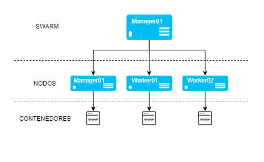
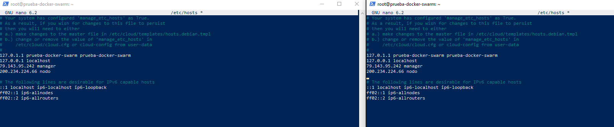
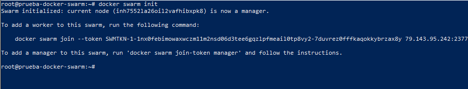
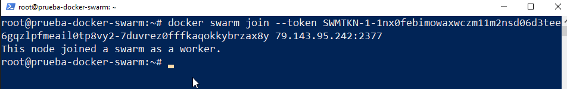
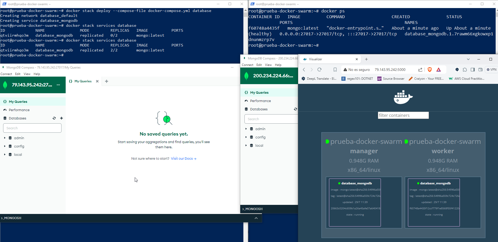

# Docker Swarm
Docker swarm es una forma de orquestar contenedores de una forma sencilla y eficaz

Docker swarm es una solución de alto nivel para solucionar el dilema de docker-compose de cara a los deploys en producción y es que docker-compose es muy util de cara testing o deploy en entornos muy sencillitos, pero en el momento que necesitamos tener una infraestructura mas grande, donde, por ejemplo, tenemos replicas de un mismo servicio, necesitamos diferentes servidores, etc. El despliegue se complica.

Para las soluciones cloud puras como `Azure`, `AWS`, etc. Generalmente han adoptado kubernetes y no suelen tener soporte de docker swarm, por eso, esta herramientas se ha destinado un poco mas hacia el deploy distribuido en servidores personales, VPS, etc. Puesto que es sencillo de implementar y de usar

> La documentacion en la que me he basado es el blog de clouding.io sobre [docker swarm](https://help.clouding.io/hc/es/articles/13450413904156-Instalar-Docker-Swarm-en-Ubuntu-22-04-LTS)

> **Consejo**: Para hacer deploy con swarm, es mas sencillo subir la imagen a un registry de docker




Ejecutamos los siguientes comandos para instalar `Docker`
```bash
apt update && apt upgrade
apt install docker.io docker-compose
systemctl is-enabled docker
systemctl status docker
```

Accedemos a `/etc/hosts` y asignamos las ip del manager y los workers correspondientes


Ejecutamos el comando `docker swarm init` y cogemos el comando que tenemos que ejecutar en los workers para hacer el pareado con el nodo manager


Ejecutamos el comando de pareado en los nodos worker correspondientes



Para deplegar la imagen, es similar a cuando ejecutamos un docker-compose

Creamos un archivo docker-compose.yml en el que podemos establecer la configuracion de los puertos, volumenes, etc.
```yaml
services:
  mongodb:
    image: mongo
    ports:
      - 27017:27017
    environment:
      - MONGO_INITDB_ROOT_USERNAME
      - MONGO_INITDB_ROOT_PASSWORD
      - MONGO_INITDB_DATABASE
    healthcheck:
      test: ["CMD-SHELL", "mongosh", "db.runCommand('ping').ok"]
      interval: 1m
      timeout: 10s
      retries: 3
      start_period: 20s
    volumes:
      - mongodb_data:/data
      - mongodb_data:/data/db
      - mongodb_data:/data/configdb
    deploy:
      replicas: 2
      resources:
        limits:
          cpus: "1.0"
          memory: 512M
        reservations:
          cpus: "0.5"
          memory: 256M
      restart_policy:
        condition: on-failure

volumes:
  mongodb_data:
```
La diferencia es que hay un nodo, que se llama `deploy` y que es usando para docker swarm en el que indicamos el numero de instancias que tiene que tener el servicio donde podemos establecer las condiciones de restar y recursos maximos y minimos

> En este caso se indica que se va a desplegar el servicio e 2 replicas, las cuales tienen como recursos minimos 0.5 cores y 256mb de memoria RAM y puede llegar a usar como maximo 1 core y 512mb de RAM


Para ejecutar hacer deploy de este docker-compose necesitamos ejecutar el siguiente comando:
```bash
docker stack deploy --compose-file docker-compose.yml nombrestack
```
- `nombrestack` es un nombre que asignamos nosotros para identificar el cluster sobre este conjunto de servicios para poder hacer consultas sobre el

> La ejecucion engaña, parece que ha terminado, pero en realidad esta procesando en background todo el proceso de deploy y suele tardar bastante


En la imagen se puede apreciar como despues de ejecutar el comando, tarda un poco y al final indica que esta en ambas replicas

Las 2 ventanas de Mongo, tienen la conexion establecida en las 2 instancia y el servicio para poder ver el estado de los contenedores de los servicio aparece que estan corriendo como se espera

- Para activar el servicio de docker, en el nodo manager tenemos que ejecutar lo siguiente:
    ```bash
    apt install unzip
    ```
    ```bash
    wget https://github.com/dockersamples/docker-swarm-visualizer/archive/master.zip
    ```
    ```bash
    unzip master.zip
    ```
    ```bash
    mv docker-swarm-visualizer-master dockersamples
    ```
    ```bash
    docker run -it -d -p 5000:8080 -v /var/run/docker.sock:/var/run/docker.sock dockersamples/visualizer
    ```

## Comandos

1. **`docker swarm init`**  
   **Descripción**: Inicializa un nuevo clúster de Docker Swarm en el nodo actual.
   **Ejemplo**:
   ```sh
   docker swarm init
   ```

2. **`docker swarm join`**  
   **Descripción**: Únete a un clúster de Docker Swarm como un nodo trabajador o administrador.
   **Ejemplo**:
   ```sh
   docker swarm join --token <TOKEN> <IP_DEL_NODO_MANAGER>:<PUERTO>
   ```

3. **`docker swarm leave`**  
   **Descripción**: Deja el clúster de Docker Swarm (nodo trabajador o administrador).
   **Opciones comunes**:
   - `--force`: Fuerza la salida, eliminando el nodo del clúster.
   **Ejemplo**:
   ```sh
   docker swarm leave
   ```

4. **`docker node ls`**  
   **Descripción**: Lista todos los nodos en el clúster de Docker Swarm.
   **Ejemplo**:
   ```sh
   docker node ls
   ```

5. **`docker node update`**  
   **Descripción**: Actualiza las propiedades de un nodo en el clúster de Docker Swarm.
   **Opciones comunes**:
   - `--availability <availability>`: Cambia la disponibilidad del nodo (e.g., `active`, `drain`, `pause`).
   **Ejemplo**:
   ```sh
   docker node update --availability drain <ID_DEL_NODO>
   ```

6. **`docker node inspect`**  
   **Descripción**: Muestra información detallada sobre un nodo específico.
   **Ejemplo**:
   ```sh
   docker node inspect <ID_DEL_NODO>
   ```

### Comandos para Servicios en Docker Swarm

1. **`docker service create`**  
   **Descripción**: Crea un nuevo servicio en el clúster de Docker Swarm.
   **Opciones comunes**:
   - `--name <nombre>`: Nombre del servicio.
   - `--replicas <número>`: Número de réplicas deseadas.
   - `-p <puerto_host>:<puerto_contenedor>`: Mapea puertos.
   **Ejemplo**:
   ```sh
   docker service create --name mi-servicio --replicas 3 -p 80:80 mi-imagen:latest
   ```

2. **`docker service ls`**  
   **Descripción**: Lista todos los servicios en el clúster de Docker Swarm.
   **Ejemplo**:
   ```sh
   docker service ls
   ```

3. **`docker service update`**  
   **Descripción**: Actualiza un servicio existente en Docker Swarm.
   **Opciones comunes**:
   - `--image <imagen>`: Cambia la imagen del servicio.
   - `--replicas <número>`: Cambia el número de réplicas.
   **Ejemplo**:
   ```sh
   docker service update --image mi-nueva-imagen:latest mi-servicio
   ```

4. **`docker service scale`**  
   **Descripción**: Cambia el número de réplicas de un servicio en Docker Swarm.
   **Ejemplo**:
   ```sh
   docker service scale mi-servicio=5
   ```

5. **`docker service rm`**  
   **Descripción**: Elimina un servicio del clúster de Docker Swarm.
   **Ejemplo**:
   ```sh
   docker service rm mi-servicio
   ```

6. **`docker service inspect`**  
   **Descripción**: Muestra información detallada sobre un servicio.
   **Ejemplo**:
   ```sh
   docker service inspect <ID_DEL_SERVICIO>
   ```

7. **`docker service logs`**  
   **Descripción**: Muestra los logs de un servicio.
   **Opciones comunes**:
   - `-f`: Sigue los logs en tiempo real.
   - `--tail <número>`: Muestra solo las últimas `<número>` líneas de logs.
   **Ejemplo**:
   ```sh
   docker service logs -f mi-servicio
   ```

8. **docker rollback**  
   **Descripción**: Permite hacer rollback ante un cambio de estado de un servicio, por ejemplo, un cambio de config o un deploy   
   **Ejemplo**:
   ```sh
   docker service rollback my-service
   ```
### Comandos para Pilas (Stacks)

1. **`docker stack deploy`**  
   **Descripción**: Despliega una pila (stack) en Docker Swarm usando un archivo `docker-compose.yml`.
   **Opciones comunes**:
   - `-c <archivo>`: Especifica el archivo `docker-compose.yml`.
   **Ejemplo**:
   ```sh
   docker stack deploy -c docker-compose.yml mi-pila
   ```

2. **`docker stack ls`**  
   **Descripción**: Lista todas las pilas desplegadas en Docker Swarm.
   **Ejemplo**:
   ```sh
   docker stack ls
   ```

3. **`docker stack services`**  
   **Descripción**: Lista los servicios en una pila específica.
   **Ejemplo**:
   ```sh
   docker stack services mi-pila
   ```

4. **`docker stack ps`**  
   **Descripción**: Muestra los contenedores que forman parte de una pila específica.
   **Ejemplo**:
   ```sh
   docker stack ps mi-pila
   ```

5. **`docker stack rm`**  
   **Descripción**: Elimina una pila (stack) del clúster de Docker Swarm.
   **Ejemplo**:
   ```sh
   docker stack rm mi-pila
   ```

6. **`docker stack inspect`**  
   **Descripción**: Muestra información detallada sobre una pila.
   **Ejemplo**:
   ```sh
   docker stack inspect mi-pila
   ```
