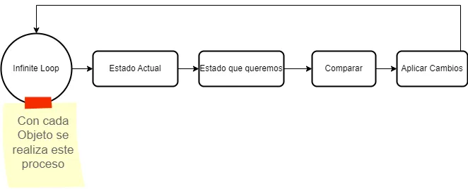

# Kubernetes
Es una tecnologia nacida en Google, que es de código abierto y el objetivo es facilitar los deploys de las aplicaciones, automatizando todo el proceso basandose en una serie de instrucciones que nosotros le adjuntamos a traves de un fichero de configuración.

La idea de kubertenes es la de desplegar la aplicacion en un cluster a traves de contenedores optimizando y buscando la mejor reparticion de recursos del cluster para obtener los mayores beneficios posibles en terminos de necesidades, escalabilidad, rendimiento y precio.

Para poder cumplir con ese objetivo de maxima utilizacion y de abstracción del cluster de cara al usuario, kubernetes modela el ciclo de vida de las aplicaciones.
> Cuando se habla del ciclo de vida de una aplicacion se refiere a todos los procesos desde crear, desplegar, escalar, monitorizar, recursos de CPU, Memoria, etc.

Para poder hacer todo este proceso de una forma sencilla y eficaz, kubernetes dispone de un lenguaje común donde, a traves de un API, nosotros podemos declarar como queremos que se realice ese ciclo de vida de nuestras aplicaciones.

Nuestro objetivo es tener unas configuraciones declarativas donde configuraremos si una aplicacion depende de otras, cuantos recursos de CPU, memoria, número de instancias, etc. y cuando tengamos eso, lo enviamos a Kubernetes a traves de ese API y de forma totalmente asincrona, kubernetes lee la declaracion y realiza las acciones necesarias para cumplir lo que se necesita
> Un depliegue con kubernetes puede tardan varios minutos, puesto que se realiza de forma async y cuando va encontrando recursos donde alojar lo que solicitamos

En las especificaciones declarativas nuestras indicamos lo siguiente:
- **kind**: Indica el tipo de objeto
- **apiVersion**: La estructura de los objetos esta versionada, aqui se indica cual queremos
- **metadata**: Establecemos informacion referia al objeto, nombre, etiquetas, etc.
- **spec**: Indicamos la declaracion del ciclo de vida de la aplicación(como queremos que quede el objeto)
- **status**: Estado actual del objeto en el cluster

## Bucle de Reconciliación
Para todo el proceso de leer la configuracion que enviamos y realizar las acciones que sea necesarias, kubernetes usa un proceso llamado **bucle de reconciliacion**

> El bucle de reonciliacion kubernetes los esta ejecutando siempre sobre todos los objetos que tiene, de esta forma, cuando encuentra que hay cambios de estado, los va aplicando

El bucle de reconciliacion consite en el siguiente proceso:


Tenemos un bucle infinito en el que se obtiene el estado actual del objeto, el estado que queremos(el que enviamos), se comparan y si hay diferencias, se van aplicando cambios y vuelta a empezar.

Este proceso del bucle de reconciliacion no lo tiene solo 1 servicio, sino que kubernetes por debajo tiene muchos servicios independientes los cuales se van encargando de diferentes partes, por eso el despliegue no es instantaneo.

## Pods
En kubernetes cuando queremos crear y desplegar una aplicacion necesitamos crear un `pod`.

Un pod es un conjunto de contenedores y de volumenes de datos que van a componer la aplicacion

> Un pod es como el equivalente a un contenedor de docker, pero en el caso de kubertenes un pod puede tener mas de un contendor, por ejemplo, si nuestra aplicacion tenemos sistemas de conversion de logs, temas de seguridad, etc. En vez de meterlo todo en la imagen de nuestra aplicacion de base, podemos fragmentarlo en diferentes containers dentro del mismo pod para tener mas separación

Cuando nosotros ejecutamos aplicaciones en docker, cada contenedore de docker, usa los `cgroups` de Linux para limitar lo que cada contenedor puede ver(nerworking, procesos, disco, etc.)

> Todos esos contendores dentro de un poc de kubernetes, todos comparten el mismo namespace de networking, por tanto, podran lanzar una consulta a localhost y podran conectar entre si

La direccion ip que reciben los pod es privada, eso significa que no se puede acceder desde fuera del cluster, por tanto no podemos enviar una peticion a esa aplicacion desde mi ordenador. En cambio, si que pueden ser accedidas desde otros pods(porque estan en el mismo cluster)

El pod es la unidad de recursos mas pequeñas que puedo crear en kubernetes, si quiereo ejecutar un contendor en kubernetes, tengo que hacer uso de un pod.

Kubertenes me permite una abstraccion del cluster y de la infraestructura y ya no hay que pensar en servidores individuales, aunque haya varias instancias, la idea es que pienses como si fuera 1 solo
> Si tienes 10 instancias con 4 cores y 16GB de RAM, hay que pensar como si esa aplicacion tuviera 40 cores y 160GB de RAM, todo en conjunto, no por separado

Cuando creamos un pod, necesitamos especificar que recursos va a necesitar. Kubernetes va a intentar colocar teniendo en cuenta lo que el pod necesita de recursos con los recursos disponibles dentro del cluter, evalue si hay sitio y si es asi, lo coloca.

> Puede ser que varias aplicaciones acaben en el mismo servidor, pero es totalmente transparente para nosotros

Cada pod tiene su propio ciclo de vida y puede ser escalado de forma independiente.

Como consejo es no poner dentro de ese pod varias aplicaciones, intentar que sean lo mas separadas posibles, puesto que si necesitas escalar o incluso matar una aplicacion, tendrias que hacerlo sobre el pod y eso afectaria al conjunto de aplicaciones de ese pod.

### Estructura de un POD

Si queremos generar una estrucutra por donde empezar, podemos ejecutar un comando como el siguiente: `kubectl run prueba --image=nginx:latest --restart=Never --port=8080 --dry-run -o yaml`

> Este es un comando que podemos ejecutar y en realidad enviaria a la api la solicitud para hacer el deploy, pero con el tag `--dry-run` lo que indicamos es que ejecute a modo de prueba y que no lo envie

```yml
apiVersion: v1
kind: Pod
metadata:
  name: nginx
  labels:
    app: nginx
    tier: backend
spec:
  containers:
  - name: my-nginx
    image: nginx:1.13
    ports:
    - containerPort: 8080
    resources:
      limits: # cantidad maxima requerida
        cpu: 50m
        memory: 32Mi
      requests: # cantidad minima requerida
        cpu: 50m
        memory: 32Mi
    livenessProbe:
      httpGet:
        path: /
        port: http
    redinessProbe:
      httpGet:
        path: /
        port: http
    restartPolicy: Never
```
Esta es la expresion declarativa en un fichero `yaml` que tenemos que enviar a kubernetes, el comando seria el siguiente `kubectl create -f pod.yaml`.

- **kind**: Indicamos que es un pod
- **metadata**
    - **labels**: Podemos indicar lo que queramos, por ejemplo, el grupo al que pertenece la app, el equipo, etc.
    - **name**: Este refiere al nombre del pod y no se puede repetir
- **spec**
    - **name**: Nombramos el contenedor del pod
    - **image**: Indicamos la imagen que queremos desplegar en el contenedor
    - **ports**: Indicamos el puerto donde queremos ejecutar la app
    - **resources**: Para indicar los recursos minimos y maximos que tiene que usar el pod, si se deja en blanco es equivalente a recursos ilimitados(**NO Recomendable**)
        - **limits**: Cantidad de recursos maximos que el pod puede llegar a consumir.
        - **requests**: El pod será colocado en algún nodo donde como mínimo haya esa cantidad de recursos, si no hay disponible esos recursos, no se creará el pod.
    - **livenessProbe**: Indicamos la ruta donde kubernetes puede comprobar que el api esta funcionando correctamente. Si detecta fallo, kubernetes intentará resolverlos reiniciando el contenedor.
    - **redinessProbe**: Establece si el contenedor esta preparado para recibir tráfico. Si este falla, kubernetes sacará este pod del servicio para que no reciba peticiones hasta que este operativo de nuevo.
    - **restartPolicy**: Definimos que queremos que haga kubernetes si el pod muere, por ejemplo, por un error


## Services
Por defecto las direcciones que reciben los pods estan limitadas al cluster privado, no se puede acceder desde fuera.

Un service nos da una direccion accesible y estable para poder enviar peticiones a los contenedores alojados en kubernetes.

> El service nos permite abstraer un conjunto de pods iguales tras la misma direccion(parecido a un load balancer)

Cuando se crea un Service kubernetes crea un objeto(mediante el bucle de reconciliacion) **Endpoint** que contendra las IPs de los Pods que esten vivos.

Para relacionar un pod con un service, se hace uso del campo de **metadata**, donde indicamos el mismo nombre que el que tiene el pod al que hacemos referencia.

### Estructura de un Service
> Para generar un archivo base de service podemos usar el comando `kubectl expose pod/nombrePod --port 80 --dry-run -o yaml`

```yaml
apiVersion: v1
kind: Service
metadata:
  name: nginx-service
spec:
  selector:
    app: nginx
    tier: backend
  ports:
    - protocol: TCP
      port: 80
      targetPort: 80
  type: LoadBalancer
```

- **kind**: Indicamos que queremos un Service
- **metadata**
    - **name**: El nombre que vamos a declarar al Service 
- **spec**: La especificacion de que va a hacer el service
    - **selector** Es la forma que tenemos de decirle al Service que PODS tienen que estar detras de este service, se basa en los labels del metadata configurado en los pods
    - **ports**
        - **protocol**: Protocolo de comunicación que recibe
        - **port**: El puerto que escucha el service dentro del cluster
        - **targetPort**: El puerto en el contenedor donde se dirige el trafico
        - **nodePort**: Indicamos el puerto desde el que queremos que el servicio sea accesible con el tipo **NodePort**, esto es útil si queremos definir nuestro load balancer aparte(por ejemplo, con un proveedor como cloudflare)
    - **Type**: indicamos el tipo de service, si no indicamos nada se establecera por defecto `ClusterIP` 
        - **ClusterIP**: El Service obtiene una IP estable(no cambia) que solo es accesible desde otros PODS ejecutandose dentro del cluster, no se puede acceder desde fuera
        - **NodePort**: En todos los nodos del cluster va a estar expuerto un puerto y consultando sobre ese puerto, se accederá por detras al pod correspondiente. El Service sera accesible desde cualquier `<IP-Nodo>:<Puerto>` del cluster. El puerto al que tenemos que acceder se genera aleatoriamente y solo podremos acceder al servicio a través del puerto generado
        - **LoadBalancer**: Solicita al proveedor de cloud correspondiente la creacion y configuracion de un `Load Balancer`, este tendra una direccion accesible desde fuera y este se encargará de mandar el tráfico internamente a los pods que corresponda. **Es parecido a un NodePort, pero con la lógica de balancear la carga**
 
> Para interconectar servicios dentro del cluster, igual que en docker, podemos indicar el nombre del pod correspondiente, para probar que funciona, podemos ejecutar el comando `kubectl run --rm -i --tty my-client-app --image=alpine --restart=Never -- sh` para simular una terminal y lanzar un `curl -i nginx` contra el nombre o IP del pod correspondiente

## Deployment


## Cálculo de Recursos
Para indicar los recursos que necesitamos como la CPU o la memoria, necesitamos establecer los valores de formas concretas

- **Memoria**: La memoria se especifica en bytes, y puedes utilizar las unidades como Mi o Gi para simplificar la lectura y escritura. La conversión es la siguiente:
    - **1 Mi** = 2^20 bytes = 1,048,576 bytes
    - **1 G** = 2^30 bytes = 1,073,741,824 bytes
- **CPU**: Los valores para la CPU se especifican en *millicpus*, por lo que **1000m** representa un núcleo completo.
    - **0.5**: Representa lo mismo que **500m**, que seria medio núcleo

## Opciones para los healthcheck
Para establacer los healthcheck podemos indicar varias formas de hacer esa comprobacion. La normal suele ser la `http`, pero tambien podemos establecer otras formas como ejecutar un comando dentro del container

- **httpGet** Establece una conexion por HTTP, si no devuelve un codigo entre 200-399 será marcado como error.
    - **path**: Indicamos la ruta de la peticion HTTP donde consultar el health
    - **port**: Indicamos el puerto donde se tiene que conectar(se puede indicar los puertos por nombre, http = 80)
- **tcpSocket**: Intenta establecer una conexión por socket TCP
    - **port**
- **exec**: Ejecuta un comando a nivel del contenedor
    - **command**
- **initialDelaySeconds**: Tiempo que espera antes de realizar el primer check
- **periodSeconds**: Intervalo de tiempo entre checks
- **timeoutSeconds**: El tiempo que hay que esperar antes de darlo por fallido
- **successThreshold**:  El mínimo de checks antes de considerar que esta correcto
- **failureThreshold**: El numero de checks que indican que esta muerto
