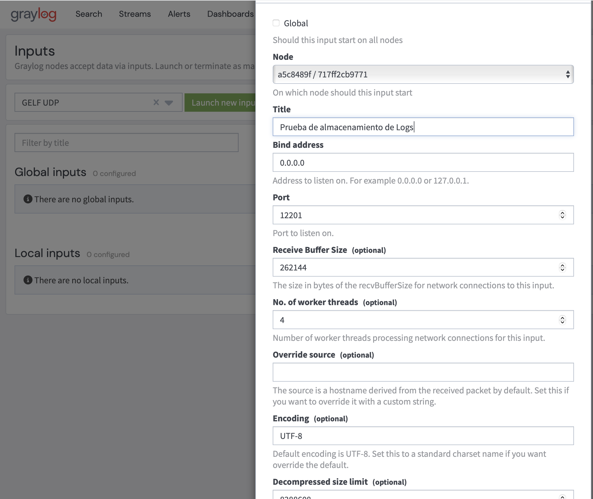
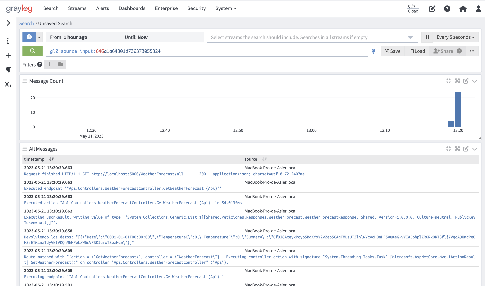

# Graylog

Es un software grafico de ingesta de logs, que permite visualizar, filtrar, sacar estadisticas, etc. Sobre los registros que tiene almacenados.


Para configurar un Input y recibir los registros, es necesario crearlo en **System > Inputs**, seleccionar el protocolo por el que se van a recibir, por lo general **GELF UDP** y configurar las opciones.



Una vez creada el input, simplemente tenemos que configurar nuestra aplicacion para que envie los registros a este servicio y configurar el Dashboard para ver los datos que necesitamos.


Si queremos ejecutar Graylog con Docker, se puede usar el siguiente script:

```yaml
#########################
# Graylog configuration #
#########################

  mongo:
    container_name: mongo_graylog
    image: mongo:5.0.13
  elasticsearch:
    container_name: elasticserach_graylog
    image: docker.elastic.co/elasticsearch/elasticsearch-oss:7.10.2
    environment:
      - http.host=0.0.0.0
      - transport.host=localhost
      - network.host=0.0.0.0
      - "ES_JAVA_OPTS=-Xms512m -Xmx512m"
    ulimits:
      memlock:
        soft: -1
        hard: -1
    deploy:
      resources:
        limits:
          memory: 1g
  graylog:
    container_name: graylog_logger
    image: graylog/graylog:5.1
    environment:
      # at least 16 characters
      - GRAYLOG_PASSWORD_SECRET=thispassshouldbeatleast16characters
      # Password: admin
      - GRAYLOG_ROOT_PASSWORD_SHA2=8c6976e5b5410415bde908bd4dee15dfb167a9c873fc4bb8a81f6f2ab448a918
      - GRAYLOG_HTTP_EXTERNAL_URI=http://localhost:9000/
    entrypoint: /usr/bin/tini -- wait-for-it elasticsearch:9200 --  /docker-entrypoint.sh
    restart: always
    depends_on:
      - mongo
      - elasticsearch
    ports:
      - 9000:9000 # Graylog web interface and REST API
      - 1514:1514
      - 1514:1514/udp
      - 12201:12201
      - 12201:12201/udp
#############################
# Graylog configuration end #
#############################
```