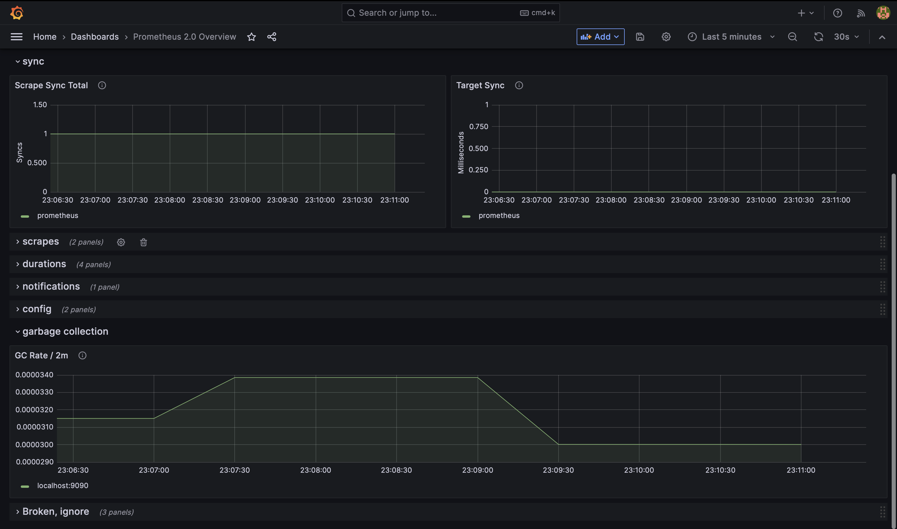

# Grafana

Es una herramienta que sirve para sacar estadisticas graficas sobre metricas de diferentes software como un API, Bases de datos, etc.

Es totalmente configurable mediante Dashboards donde se puede acceder a metricas como request por segundo, threads utilizados, memoria, reciclaje de Garbage Collector, etc.

