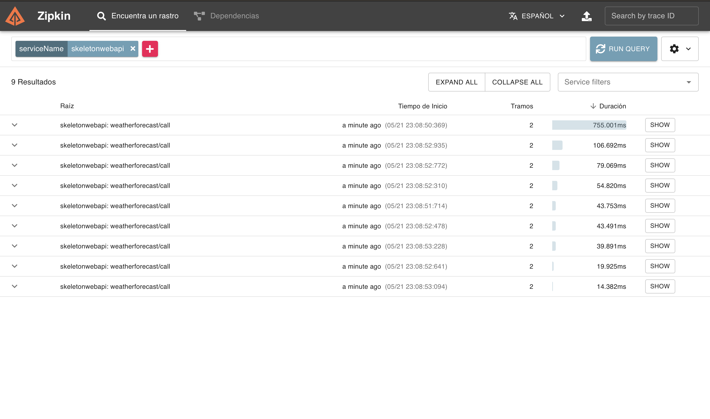
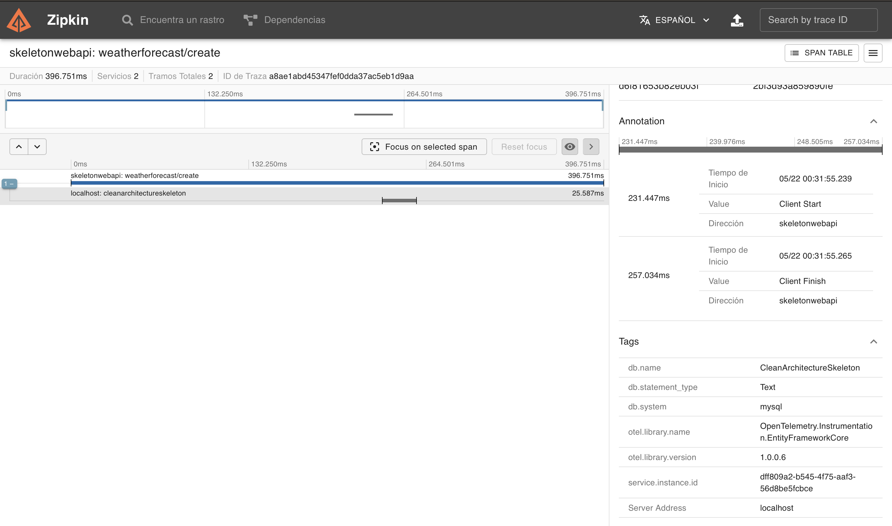
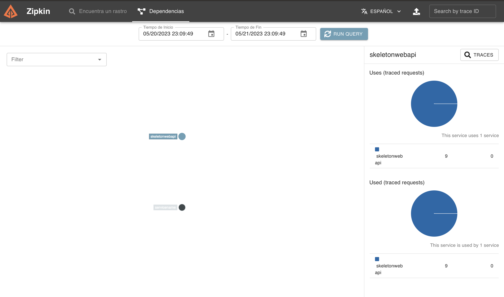

# Zipkin
Es un software que se encarga de mostrar de forma gráfica las trazas por las que pasa una peticion.

Las peticiones envian un campo llamado "TraceId" para identificar los diferentes servicios por los que pasa una petición y poder trackearla.

