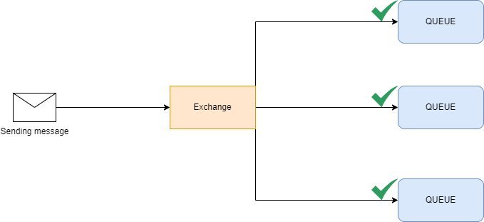

Un software que actua como `Message Broker` pensado en su uso para la programacion asincrona y distribuida.

En lugar de que 2 aplicaciones realicen una comunicacion entre si, una(productor) envia el objeto al servicio de RabbitMQ y la otra(consumidor), recibe el objeto y lo trata.

El uso principal de este sistema es la reduccion de tiempos de espera para tareas que no necesitemos una respuesta inmediata, por ejemplo, enviar un correo, sincronizar una base de datos, sincronizar caches, etc.

Para poder realizar todo este proceso Rabbit implementa el protocolo AMQP(Advanced Message Queuing Protocol)

# AMQP
Es un protocolo de red que se utiliza para la comunicación entre aplicaciones que envian y reciben mensajes.

Se diseño con el proposito de permitir la comunicacion entre componentes de infraestructura de forma asíncrona para procesos que no se nececesite una respuesta inmediata.


# Broker
El funcionamiento de RabbitMQ es el siguiente:


- **Producer**: Envia un mensaje a Rabbit, por ejemplo, un json
- **Exchange**: Es el componente que, a traves de las Routing Key decide hacia que colas tiene que enviar los mensajes recibidos
- **Routing Key**: Es un valor que tiene que venir dado en el mensaje y se usa para evaluar hacia donde tiene que ir el mensaje, en el ejemplo, una routingkey seria `shop.user.*`
- **Binding Key**: Es un valor asociado a la QUEUE que se usa para compararlo con la `Routing Key` y de esta manera saber a donde hay que dirigir el mensaje.
- **Queue**: Almacena los mensajes en memoria y los va enviando a los consumer a través del sistema `FIFO`
- **Consumer**: Es un proceso externo al protocolo de rabbit y su misión es esperar a recibir el mensaje para procesarlo como sea necesario

> Como se puede ver en la imagen, una cola puede tener varios consumer, rabbit se encargará de enviar el mensaje de esa cola a todos los suscriptores

> Cuando el mensaje es procesado y se recibe `ACK`, es eliminado de la memoria y desaparece de rabbit **todos los mensajes van a la memoria**


# Exchange
Se encargan de transferir los mensajes a las colas configuradas en el exchange a traves de los bindings basandose en la `routing key` y la `binding key`.

- **Binding Key**: Cuando definimos una cola, establecemos el valor de la binding key para saber que mensajes tienen que ir hacia esa cola, por ejemplo `subscription.weatherForecast`

- **Routing Key**: Cuando enviamos un mensaje, indicamos la clave de enrutado para que rabbit sepa hacia que colas tiene que enviarlo

## Direct
Cuando llega el mensaje, comprueba si la **routing key** que recibimos coindide con la **binding key** configurada entre el exchange y la cola


## fanout
El concepto de binding key y routing key es totalmente eliminado, simplemente recibe el mensaje y lo inyecta a todas las colas que rabbit tiene disponibles


## Header
El tipo header funciona como el direct, pero en vez de **routing keys** se utilizan **cabeceras o parametros**


En la configuración entre el exchange y la cola se establece las cabeceras que se esperan y  el campo **x-match** con los valores:
- **all**: Indica que tienen que coincidir todas las cabeceras
- **any**: Indica que tienen que coindicidr alguna de las cabeceras

El mensaje nos trae las cabeceras y se evaluan en el exchange para dirigia a la cola

## Topic
Se configura el match a nivel de la binding key y se hace mediante el uso de *wildcards*

- **\***o *single level wildcard*: hará match con una única palabra. Por ejemplo `shop.*.created` coincidirá siempre con cualquier mensaje de creación de recursos dentro de `shop` como `shop.order.created` o `shop.product.created`

- **#** o *multi-level wildcard*: hará match con cualquier número de palabras. Por ejemplo, `shop.#` coincidirá con cualquier mensaje del contexto `shop` como `shop.order.created` o `shop.user.registered`


# Queues
RabbitMQ trabaja con un sistema de colas, un mensaje entra por un lado y se envia al consumidor por el otro. Una vez el mensaje ha desaparecido de la cola, no se puede recuperar.


## DeadLetter
Cuando un mensaje no puede ser enrutado a su cola de destino o cuando se agota su tiempo de vida, RabbitMQ puede redirigir ese mensaje a otra cola designada como la "dead-letter"

El uso de dead-letter exchanges proporciona una manera de manejar mensajes que no pueden ser procesados en el flujo normal de trabajo, en lugar de perderlos o enviarlos indefinidamente a una cola de espera.

1. **Mensaje rechazado**: Si un consumidor rechaza o no puede manejar un mensaje específico, se puede redirigir a la cola de mensajes no entregados para su posterior revisión o reintentos.

2. **Tiempo de vida del mensaje agotado**: Cuando un mensaje ha estado en una cola durante un tiempo determinado y no ha sido procesado, puede ser enviado automáticamente a la cola de mensajes no entregados.

3. **Cola llena**: Si la cola de destino está llena, se pueden enviar los mensajes excedentes a la cola de mensajes no entregados para evitar pérdida de datos.

4. **Error en el enrutamiento**: Si un mensaje no puede ser enrutado a la cola deseada debido a un error en la configuración, se puede redirigir a la cola de mensajes no entregados para su posterior análisis.

# Configuración
En Rabbit se puede crear un archivo JSON en el que podemos establecer directamente la configuracion de las colas y los exchange y como enlazarlos.

Este es un archivo de configuracion de rabbit en el que podemos establecer usuarios, permisos, configuracion de exchanges, colas, etc. Se puede importar desde el gestor visual de Rabbit directamente.
```JSON
{
    "queues": [
        {
            "name": "publisher",
            "vhost": "/",
            "durable": true,
            "auto_delete": false,
            "arguments": {
                "x-dead-letter-exchange": "dead-letter.exchange",
                "x-dead-letter-routing-key": "publisher.dead-letter",
                "x-message-ttl": 20000
            }
        },
        {
            "name": "publisher.dead-letter",
            "vhost": "/",
            "durable": true,
            "auto_delete": false,
            "arguments": {
            }
        },
        {
            "name": "subscription.weatherForecast",
            "vhost": "/",
            "durable": false,
            "auto_delete": false,
            "arguments": {
                "x-dead-letter-exchange": "dead-letter.exchange",
                "x-dead-letter-routing-key": "subscription.weatherForecast.dead-letter",
                "x-message-ttl": 20000
            }
        },
        {
            "name": "subscription.weatherForecast.dead_letter",
            "vhost": "/",
            "durable": false,
            "auto_delete": false,
            "arguments": {}
        }
    ],
    "exchanges": [
        {
            "name": "dead-letter.exchange",
            "vhost": "/",
            "type": "direct",
            "durable": true,
            "auto_delete": false,
            "internal": false,
            "arguments": {}
        },
        {
            "name": "subscription.exchange",
            "vhost": "/",
            "type": "topic",
            "durable": true,
            "auto_delete": true,
            "internal": false,
            "arguments": {}
        }
    ],
    "bindings": [
        {
            "source": "subscription.exchange",
            "vhost": "/",
            "destination": "publisher",
            "destination_type": "queue",
            "routing_key": "subscription.#",
            "arguments": {}
        },
        {
            "source": "subscription.exchange",
            "vhost": "/",
            "destination": "subscription.weatherForecast",
            "destination_type": "queue",
            "routing_key": "subscription.*",
            "arguments": {}
        },
        {
            "source": "dead-letter.exchange",
            "vhost": "/",
            "destination": "publisher.dead-letter",
            "destination_type": "queue",
            "routing_key": "publisher.dead-letter",
            "arguments": {}
        },
        {
            "source": "dead-letter.exchange",
            "vhost": "/",
            "destination": "subscription.weatherForecast.dead_letter",
            "destination_type": "queue",
            "routing_key": "subscription.weatherForecast.dead-letter",
            "arguments": {}
        }
    ]
}
```
- **queues**: En esta sección debemos de configurar las colas que necesitamos, generalmente una por cada caso de uso de la aplicación
    - **name**: Nombre de la cola que necesitamos
    - **vhost**: El Virtual host se usa para hacer una separación lógica de recursos en Rabbit
    - **durable**: Indicamos si queremos que se almacene los datos de la cola en disco, esto es importante por si el servidor se reinicia
    - **auto_delete**: Con este campo indicamos si queremos que la cola se elimine cuando no detecte consumers(nadie esta suscrito a la cola)
    - **arguments**: Se puede indicar configuraciones adicionales como, por ejemplo, si queremos que un mensaje se envie a otra cola si es rechazado o expira, o queremos establecer un tiempo maximo en cola, etc.
- **exchanges**:
    - **name**: Nombre del exchange
    - **vhost**: Ubicacion logica donde va a estar este recurso
    - **type**: El tipo del Exchange(direct, topic, etc.)
    - **durable**: Indicamos si queremos almacenarlo en disco para prevenir perdida de información ante reinicios inesperados
    - **auto_delete**: Si no hay colas enlazadas se elimina automaticamente
    - **internal**: Indicamos si es un proceso que se hace de forma interna(a nivel de rabbit) o tiene que estar abierto a recibir los mensajes de producers
    - **arguments**: Configuracion adicional, por ejemplo, para establecer exchanges alternativos si este no tiene ninguna cola enlazada.
- **bindings**:
    - **source**: El Exchange que hay que evaluar
    - **vhost**: Ubicacion logica del recurso
    - **destination**: Cola de destino donde se va a enviar el mensaje
    - **destination_type**: El tipo de destino(queue)
    - **routing_key**: La routing key que va a tener que evaluar rabbit para saber a que colas tiene que enviar el contenido en base a la routing key que nos viene en el mensaje(*Esto seria lo que llamamos la binding key*)
    - **arguments** Aqui es donde se asignarian las condiciones de binging cuando evaluamos por headers

