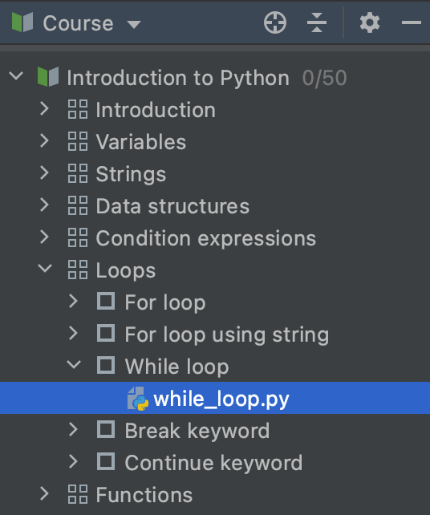

## Vista del Curso

<b>Vista del Curso</b> muestra el temario del curso: una lista de lecciones con tareas.

Puedes navegar a cualquier tarea haciendo doble clic en su nombre.

Para ocultar la ventana de la Vista del Curso, haz clic en el botón de la Ventana de Herramientas del Proyecto o presiona &shortcut:ActivateProjectToolWindow;. Esto te dará más espacio para las ventanas del Editor y Descripción de la Tarea.

Para mostrar la ventana de la Vista del Curso oculta, haz clic en el botón de la Ventana de Herramientas del Proyecto (o presiona &shortcut:ActivateProjectToolWindow;) de nuevo.