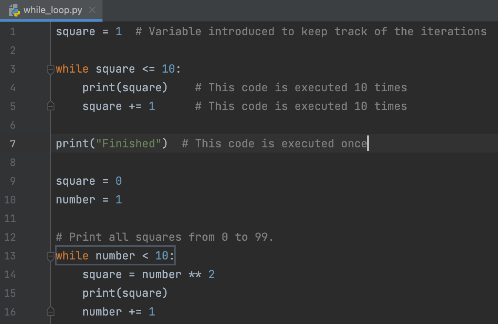

## Editor

El <b>Editor</b> es tu campo de juego donde estarás programando. Puedes experimentar aquí mientras trabajas en tareas teóricas y cuestionarios sin ser revisado.

Para las tareas de programación, el Editor es donde corregirás el código existente o escribirás tu propio código desde cero. Este código será revisado.

Para ejecutar tu código en cualquier momento, elige la opción Ejecutar del menú contextual o presiona &shortcut:Run;:

Si quieres volver al Editor y concentrarte en tu código, la forma más rápida de hacerlo es con el comando Ocultar Todas las Ventanas (&shortcut:HideAllWindows;). Para recuperar todas las ventanas, repite el comando.