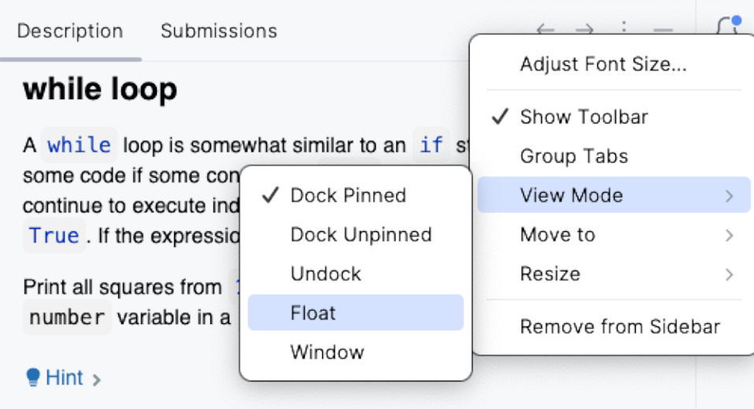

## Descripción de la tarea

La ventana de **Descripción de la tarea** te proporciona toda la información que necesitas para completar una tarea:

Para tareas teóricas, la descripción proporciona materiales de aprendizaje y lectura.
Para cuestionarios, ofrece preguntas de opción múltiple.
Para tareas de programación, enuncia el problema a resolver.

Utiliza los iconos de Descripción de la tarea para las siguientes acciones:

| Icono | Descripción |
|----|-----|
|**Check** | Verifica la corrección de tu respuesta (para un cuestionario) o tu solución de código (para una tarea de programación)|
| **Run** | Ejecuta tu código (para una tarea teórica)|
| | Vuelve a la tarea anterior |
| &nbsp;o **Next** | Pasa a la siguiente tarea | 
| | Descarta todos los cambios que hayas hecho en la tarea y empieza de nuevo | 
| | Visualiza la página de la tarea en Stepik y deja un comentario | 
|<a>Peek Solution...</a> | Revela la respuesta correcta y muestra la <b>diferencia</b>|

Recomendamos mantener la ventana de Descripción de la tarea visible y no ocultarla por completo. Si resulta demasiado distractora, puedes ocultarla haciendo clic en el botón  en la esquina superior derecha de la ventana de Descripción de la tarea.

Si utilizas dos monitores, puede ser útil cambiar el panel de Descripción de la tarea al modo flotante y moverlo al segundo monitor, o simplemente colocarlo cerca de la ventana principal de la IDE. Para hacer esto, haz clic en el icono de configuración de la ventana de herramienta  /  :

