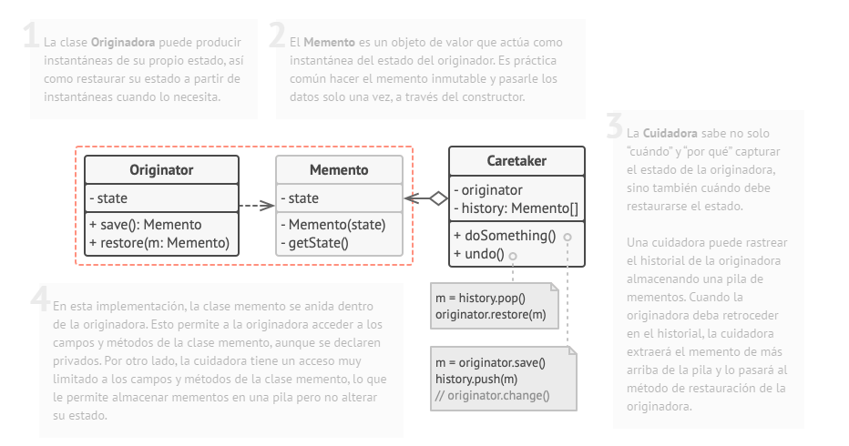
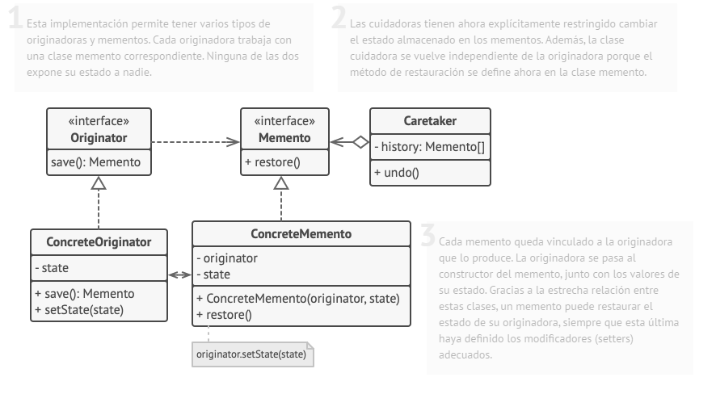
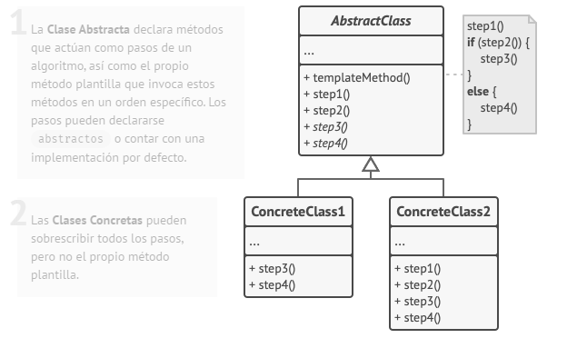

# Patrones de Comportamiento

## Chain of Responsability
También llamado: **Cadena de Responsabilidad**  
Ejemplo de uso: **Middleware**

### Proposito

Patrón de diseño de comportamiento que te permite pasar solicitudes a lo largo de una cadena de manejadores. Al recibir una solicitud, cada manejador decide si la procesa o si la pasa al siguiente manejador de la cadena.

### Problema

Cuando hay comunicación entre 2 objetos, normalmente estos se acoplan mediante una conexión. Pretendemos desacoplar el sistema, pero nuestro problema es que el receptor del mensaje no va a conocer directamente el origen del mismo. El patrón Chain of Resbonsability trata de resolver esta situación.

Se aplica cuando:

- Varios objetos pueden manejar cierta petición, y el manejador no se conoce a priori, sino que debería determinarse automáticamente.
- Pretendemos enviar un mensaje a un objeto entre varios sin especificar explícitamente el receptor.
- Los objetos que pueden tratar el mensaje deberían ser especificados dinámicamente.

### Solucion

Para solucionar este problema debemos encontrar un mecanismo mediante el cual pasar mensajes a través la cadena de objetos, para que si el que lo recibe no sabe procesarlo lo pase a otro objeto.

Para lograr esto, crearemos una interfaz Manejador que permite tratar las peticiones en general. Crearemos también algunos ManejadoresConcretos que son los que se encargan de procesar una petición concreta. El cliente que desea enviar el mensaje pasará el mismo a un Manejardor concreto, que se encargará o bien de procesarlo o bien de transferirlo a otros objetos que pertenezcan a la cadena.

### Estructura

## Command
También llamado: **Transaction**

### Proposito

Patrón de diseño de comportamiento que convierte una solicitud en un objeto independiente que contiene toda la información sobre la solicitud. Esta transformación te permite parametrizar los métodos con diferentes solicitudes, retrasar o poner en cola la ejecución de una solicitud y soportar operaciones que no se pueden realizar.

### Problema

En el contexto de programación actual un simple programa puede ejecutar decenas, o incluso centenares, de invocaciones a subprocesos o subprogramas. En ocasiones es muy conveniente desacoplar la invocación de determinados procesos del contexto donde se encuentran, y ésto es precisamente el problema que viene a solucionar el patrón Command.

Además pueden surgir situaciones en las que las invocaciones deban de tratarse por medio de una cola, pila o estructura de datos similar. Mediante el patrón Command podemos realizar estas acciones de manera sencilla.

Se aplica cuando:

- Precisamos de colas, pilas u otras estructuras para gestionar las invocaciones.
- Exista la posibilidad de cancelar operaciones.
- Se necesite parametrizar de manera uniforme las invocaciones.
- El momento de ejecución del subprograma o subproceso deba de ser independiente del contexto en el que se invoca.
- Necesitemos realizar llamadas a órdenes cuyos parámetros puedan ser otras órdenes (callbacks).
- Las órdenes que debemos desarrollar son de alto nivel y por debajo son implementadas por órdenes simples (primitivas).

### Solucion

La solución consiste en crear una interfaz Command que contenga un método execute, permitiendo desde la misma ejecutar la operación a la que representa el comando. Adicionalmente, si se permite deshacer operaciones, deberemos añadir un método undo para poder hacerlo.

Las clases que implementen Command, a las que llamaremos ConcreteCommands, definirán la funcionalidad de la orden a la que representa el comando mediante la definición del método execute. Para ello utilizaremos los métodos del objeto que realmente implementa la funcionalidad, al que llamaremos Receiver.

La configuración de los ConcreteCommands y del Receiver se establecera mediante una entidad Client. Otra entidad llamada Invoker será la que utilizará la/las órden/órdenes implementadas.

### Estructura

## Interpreter
También llamado: **Interprete**

### Proposito

Lo que trata este patrón, como su propio nombre indica, es implementar un intérprete para un lenguaje concreto. Un ejemplo rápido de lenguaje para saber de lo que hablamos sería el de las expresiones aritméticas: dada una expresión aritmética debemos ser capaces de construir un intérprete que tomándola como entrada obtenga el resultado de evaluar dicha expresión.

### Problema

Nuestro sistema tiene que ser capaz de reconocer sentencias de un lenguaje previamente conocido (mediante su gramática), poder evaluar expresiones del mismo y ser capaz de ejecutar las sentencias recibidas.

Por ejemplo tenemos un sistema que recibe como entradas números romanos, y debemos de poder tratarlas como números enteros para poder trabajar computacionalmente con ellos.

Se aplica cuando:

- Debemos trabajar con sentencias de un lenguaje que nuestro lenguaje de programación no reconoce automáticamente.
- La gramática del lenguaje con el que debemos trabajar es sencilla. Para gramáticas complejas se deben emplear técnicas concretas de la Teoría de Gramáticas Formales (scanners y parsers).
- No debe utilizarse si ya existe alguna clase nativa que interprete éste lenguaje. Por ejemplo en Python, si recibimos una expresión aritmética mediante un String, utilizaremos la función eval() en lugar de implementar un Interpreter.

### Solucion

La solución es representar la gramática del lenguaje (previamente definida) mediante una jerarquía de objetos. Los nodos terminales de las producciones los representaremos creando clases TerminalExpression y los nodos no terminales con NonterminalExpression. Ambas clases implementan una interfaz común (o heredan de una clase abstracta común) llamada AbstractExpression y que contendrá la declaración del métdo interpret(), que se encargará de evaluar el nodo en concreto.

Además puede existir un contexto común a todas las expresiones que defina ciertos valores, funciones o características del lenguaje que estamos interpretando. Este contexto será representado con la clase Context. El cliente se encargará de construir el árbol sintáctico de la expresión y asignar el contexto en caso de haberlo.

### Estructura

## Iterator
También llamado: **Iterador**  
Ejemplo de uso: **`IEnumerable<T>`**

### Proposito

patrón de diseño de comportamiento que te permite recorrer elementos de una colección sin exponer su representación subyacente (lista, pila, árbol, etc.).

### Problema

El patrón Iterator se usa en el contexto de las listas y conjuntos. Tenemos una serie de objetos que internamente trabajan con conjuntos de elementos y necesitamos manipularlos abstrayéndonos de cómo están implementados internamente.

De esta manera si por alguna razón de eficiencia o funcionalidad necesitáramos cambiar la implementación interna del conjunto de elementos, el resto de nuestro sistema seguiría funcionando sin problemas.

Se aplica cuando:

- Debemos aplicar este patrón cuando tengamos que trabajar con objetos que internamente trabajan sobre un grupo de elementos y debamos poder manejar dichos elementos sin que un cambio en la implementación de la lista o cojunto afecte al sistema global.
- Otra situación en la que este patrón resulta de utilidad es cuando los elementos de una lista pueden ser recorridos de diferentes maneras. Por ejemplo tenemos una lista de números la cual podemos recorrer secuencialmente e inversamente, pero nuestro sistema debe hacerlo de la misma manera, sin necesidad de utilizar índices ni variables adicionales.

### Solucion

La solución consiste en crear una interfaz Iterator que estandarice los métodos para tratar la colección de elementos. Esta interfaz definirá una serie de operaciones para manipular los elementos del conjunto, como puede ser next() para obtener el siguiente elemento, hasNext() para comprobar que sigue habiendo elementos en el conjunto, current() para obtener el elemento actual o first() para mover el cursor al primer elemento y a la obtener una referencia al mismo.

Para implementar la interfaz Iterator utilizaremos una clase ConcreteIterator que implemente dicha interfaz, la cual se encargará de controlar la posición del cursor y manejar los elementos según las operaciones definidas por la interfaz.

Para crear objetos Iterator utilizaremos otra interfaz llamada Aggregate, que se encargará de devolver objetos Iterator a partir de nuestros objetos que manejan colecciones. A su vez se necesita un ConcreteAgreggate para definir de qué manera se crea cada Iterador en particular.

### Estructura

## Mediator
También llamado: **Mediador, Intermediary, Controller**  
Ejemplo de uso: **Framework `Mediatr` de .Net**

### Proposito

Patrón de diseño de comportamiento que te permite reducir las dependencias caóticas entre objetos. El patrón restringe las comunicaciones directas entre los objetos, forzándolos a colaborar únicamente a través de un objeto mediador.

### Problema

En sistemas complejos en los que múltiples componentes actúan entre si, la complejidad de las dependencias puede crecer exponencialmente si tratamos de ampliarlo. Este escenario es típico de las interfaces gráficas y muchos otros prototipos software.

Además si hubiese que modificar un componente, habría que redefinir todas las dependencias explícitas en cada uno de los demás integrantes del sistema. También podemos ver las consecuencias que esto acarrearía si surge una excepción en uno de los componentes, esta se arrastraría a todos los que dependan de ella, y a su vez a los demás, pudiendo hacer caer el sistema si no se gestiona correctamente.

El contexto en el que actúa este patrón es en el de aplicaciones o sistemas cuyos integrantes se comunican activamente. Si la complejidad en la interacción es excesiva, encapsularla en una clase no contribuye demasiado al desacoplamiento, por lo que deberemos crear varios intermediarios.

 

Se aplica cuando:

- Nuestro sistema tiene gran número de objetos que se comunican de forma activa, y dicha comunicación es compleja y está bien definida.
La reutilización de un objeto es difícil ya que es dependiente de muchos otros.
- Si nuestro sistemas es excesivamente complejo deberemos subdividirlo en varios Mediator.

### Solucion

La solución consiste en crear una entidad intermediaria que se encargue de gestionar la comunicación entre objetos. En primer lugar definiremos una interfaz para exponer las operaciones que un intermediario puede realizar, la cual llamaremos Mediator. Como es evidente debemos implementar dicha interfaz mediante una clase ConcreteMediator para dotar a éste de funcionalidad.

El siguiente paso es definir la interfaz de los integrantes del sistema, la cual llamaremos Colleague (que significa literalmente colega). Aquí se expondrán todas las operaciones que un objeto perteneciente al sistema puede realizar para comunicarse. Podemos crear diferentes tipos de colegas siempre y cuando respeten la interfaz.

### Estructura

## Memento
También llamado: **Snapshot**

### Proposito

Patrón de diseño de comportamiento que te permite guardar y restaurar el estado previo de un objeto sin revelar los detalles de su implementación.

### Problema

A veces es necesario guardar el estado interno de un objeto. Esto es necesario cuando se implementan casillas de verificación o mecanismos de deshacer que permiten a los usuarios anular operaciones provisionales y recuperarse de los errores. Debe guardarse información del estado en algún sitio para que los objetos puedan volver a su estado anterior. Pero los objetos normalmente encapsulan parte de su estado, o todo, haciéndolo inaccesible a otros objetos e imposible de guardar externamente. Exponer este estado violaría la encapsulación, lo que puede comprometer la fiabilidad y extensibilidad de la aplicación.

Se aplica cuando:

- Hay que guardar una instantánea del estado de un objeto (o de parte de éste) para que pueda volver posteriormente a ese estado, y
- Una interfaz directa para obtener el estado exponga detalles de implementación y rompa la encapsulación del objeto

### Solucion

Un memento es un objeto que almacena una instantánea del estado interno de otro objeto -el creador del memento-. El mecanismo de deshacer solicitará un memento al creador cuando necesite comprobar el estado de éste. El creador inicializa el memento con información que representa su estado actual. Sólo el creador puede almacenar y recuperar información del memento -el memento es "opaco" a otros objetos-.

### Estructura

Implementación basada en clases anidadas

Implementación con una encapsulación más estricta

## Observer
También llamado: **Listener**  
Ejemplo de uso: **Las GUI, cuando pulsas un boton, internamente el estado de ese boton cambia, puesto que ha sido pulsado y se ejecuta la accion correspondiente a ese boton.**

### Proposito

Patrón de diseño de comportamiento que te permite definir un mecanismo de suscripción para notificar a varios objetos sobre cualquier evento que le suceda al objeto que están observando.

### Problema

Se necesita la ejecucion de unas serie de instrucciones cuando el estado de un objeto cambie.

Supongamos que necesitamos enviar un correo electronico o mostrar una notificacion por pantalla cuando el precio de un producto cambie.

### Solucion

Que el objeto del cual dependen los demás (observado) tenga un listado de ellos (observadores) y les notifique cuando sea necesario. Es decir, en un cambio de estado o acción.

### Estructura

## State
También llamado: **Estado**

### Proposito

Patrón de diseño de comportamiento que permite a un objeto alterar su comportamiento cuando su estado interno cambia. Parece como si el objeto cambiara su clase

### Problema

Existe una extrema complejidad en el código cuando se intenta administrar comportamientos diferentes según una cantidad de estados diferentes. Asimismo el mantenimiento de este código se torna dificultoso, e incluso se puede llegar en algunos casos puntuales a la incongruencia de estados actuales por la forma de implementación de los diferentes estados en el código (por ejemplo con variables para cada estado).

### Solucion

El patrón State sugiere que crees nuevas clases para todos los estados posibles de un objeto y extraigas todos los comportamientos específicos del estado para colocarlos dentro de esas clases.

En lugar de implementar todos los comportamientos por su cuenta, el objeto original, llamado contexto, almacena una referencia a uno de los objetos de estado que representa su estado actual y delega todo el trabajo relacionado con el estado a ese objeto.

Para la transición del contexto a otro estado, sustituye el objeto de estado activo por otro objeto que represente ese nuevo estado. Esto sólo es posible si todas las clases de estado siguen la misma interfaz y el propio contexto funciona con esos objetos a través de esa interfaz.

Esta estructura puede resultar similar al patrón Strategy, pero hay una diferencia clave. En el patrón State, los estados particulares pueden conocerse entre sí e iniciar transiciones de un estado a otro, mientras que las estrategias casi nunca se conocen.

### Estructura

## Strategy
También llamado: **Estrategia**

### Proposito

Patrón de diseño de comportamiento que te permite definir una familia de algoritmos, colocar cada uno de ellos en una clase separada y hacer sus objetos intercambiables.

### Problema

Se debe utilizar el patrón Strategy cuando:
- Se quiera configurar una clase con un comportamiento determinado de entre varios.
- Se necesitan distintas variaciones de un algoritmo.
- Los distintos comportamientos de una clase aparecen como múltiples sentencias condicionales. El patrón Strategy permite mover cada rama de esos condicionales anidados a su propia clase.

### Solucion

El patrón Strategy sugiere que tomes esa clase que hace algo específico de muchas formas diferentes y extraigas todos esos algoritmos para colocarlos en clases separadas llamadas estrategias.

La clase original, llamada contexto, debe tener un campo para almacenar una referencia a una de las estrategias. El contexto delega el trabajo a un objeto de estrategia vinculado en lugar de ejecutarlo por su cuenta.

La clase contexto no es responsable de seleccionar un algoritmo adecuado para la tarea. En lugar de eso, el cliente pasa la estrategia deseada a la clase contexto. De hecho, la clase contexto no sabe mucho acerca de las estrategias. Funciona con todas las estrategias a través de la misma interfaz genérica, que sólo expone un único método para disparar el algoritmo encapsulado dentro de la estrategia seleccionada.

De esta forma, el contexto se vuelve independiente de las estrategias concretas, así que puedes añadir nuevos algoritmos o modificar los existentes sin cambiar el código de la clase contexto o de otras estrategias.

### Estructura

## Template Method
También llamado: **Metodo Plantilla**

### Proposito

Patrón que define el esqueleto de un algoritmo en la superclase pero permite que las subclases sobrescriban pasos del algoritmo sin cambiar su estructura.

### Problema

Imagina que estás creando una aplicación de minería de datos que analiza documentos corporativos. Los usuarios suben a la aplicación documentos en varios formatos (PDF, DOC, CSV) y ésta intenta extraer la información relevante de estos documentos en un formato uniforme.

En cierto momento te das cuenta de que las tres clases tienen mucho código similar. Aunque el código para gestionar distintos formatos de datos es totalmente diferente en todas las clases, el código para procesar y analizar los datos es casi idéntico. ¿No sería genial deshacerse de la duplicación de código, dejando intacta la estructura del algoritmo?

Hay otro problema relacionado con el código cliente que utiliza esas clases. Tiene muchos condicionales que eligen un curso de acción adecuado dependiendo de la clase del objeto de procesamiento.

### Solucion

El patrón Template Method sugiere que dividas un algoritmo en una serie de pasos, conviertas estos pasos en métodos y coloques una serie de llamadas a esos métodos dentro de un único método plantilla. Los pasos pueden ser abstractos, o contar con una implementación por defecto. Para utilizar el algoritmo, el cliente debe aportar su propia subclase, implementar todos los pasos abstractos y sobrescribir algunos de los opcionales si es necesario (pero no el propio método plantilla).

### Estructura

## Visitor
También llamado: **Visitante**

### Proposito

Patrón que te permite separar algoritmos de los objetos sobre los que operan.

### Problema

Busca separar un algoritmo de la estructura de un objeto. La operación se implementa de forma que no se modifique el código de las clases sobre las que opera.

Usa el patrón Visitor cuando:
- Una estructura de objetos contiene muchas clases de
objetos con interfaces distintas, y se quiere realizar
sobre ellos operaciones que son distintas en cada clase
concreta
- Se quieren realizar muchas operaciones distintas sobre
los objetos de una estructura, sin incluir dichas
operaciones en las clases
- Las clases que forman la estructura de objetos no
cambian, pero las operaciones sobre ellas sí

### Solucion

El patrón Visitor sugiere que coloques el nuevo comportamiento en una clase separada llamada visitante, en lugar de intentar integrarlo dentro de clases existentes. El objeto que originalmente tenía que realizar el comportamiento se pasa ahora a uno de los métodos del visitante como argumento, de modo que el método accede a toda la información necesaria contenida dentro del objeto.

### Estructura

