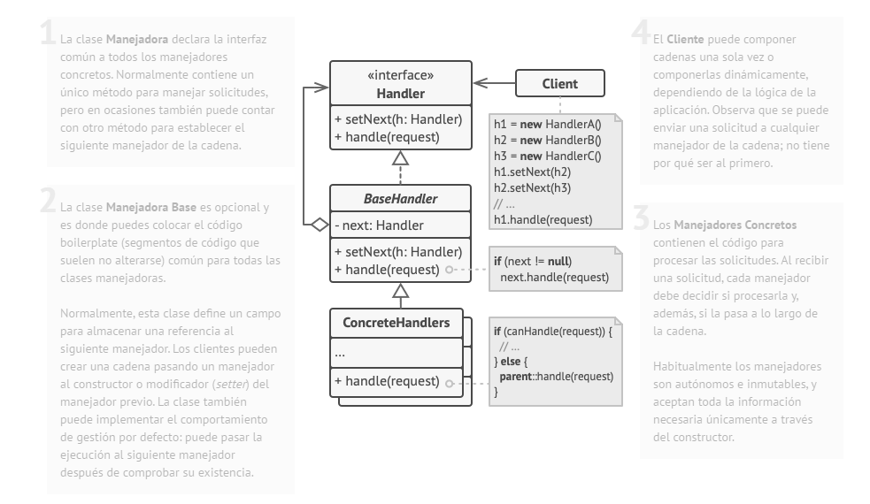
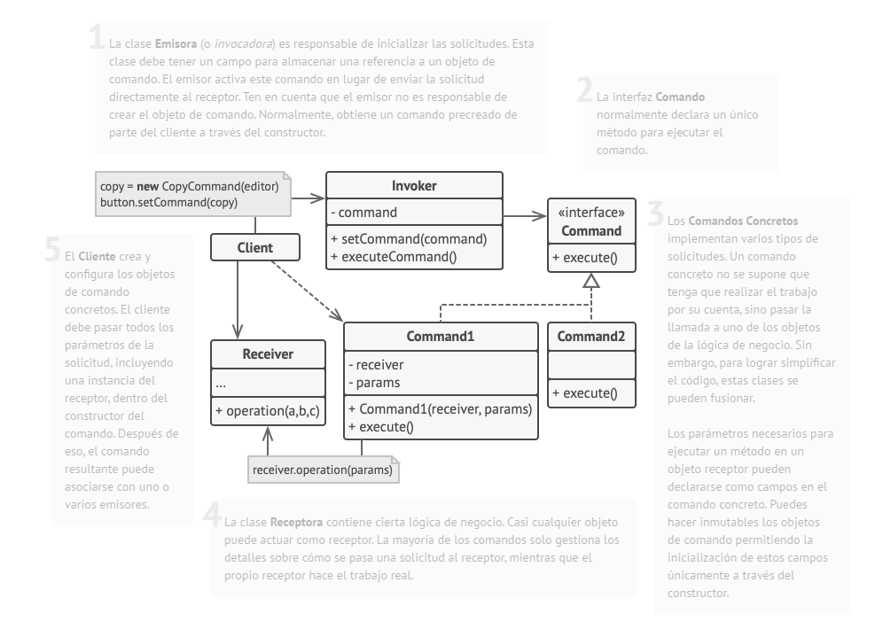
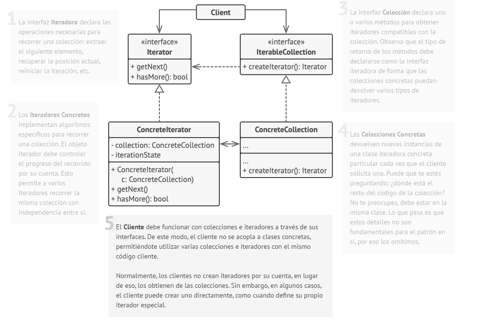
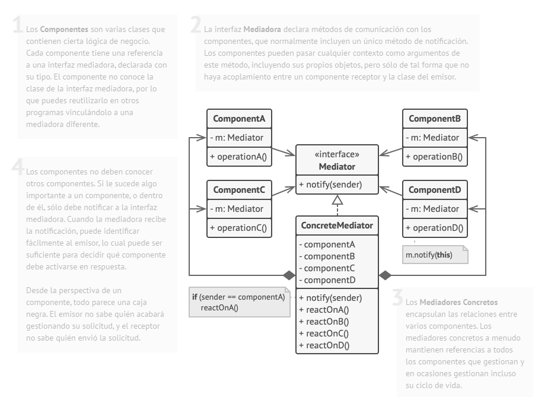
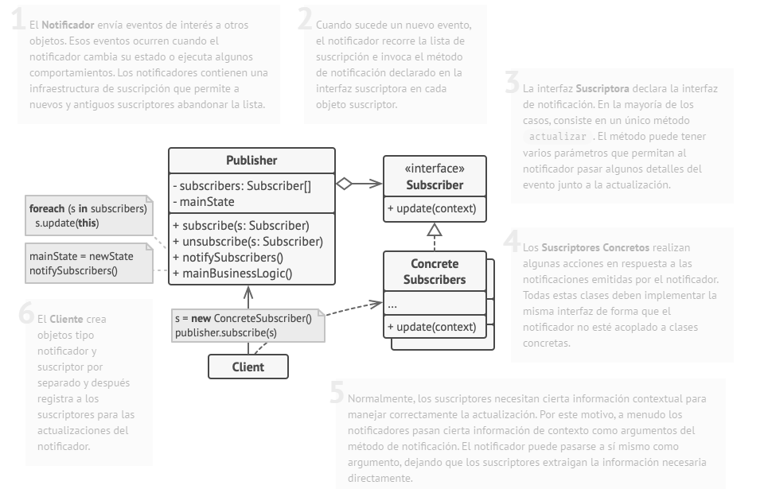
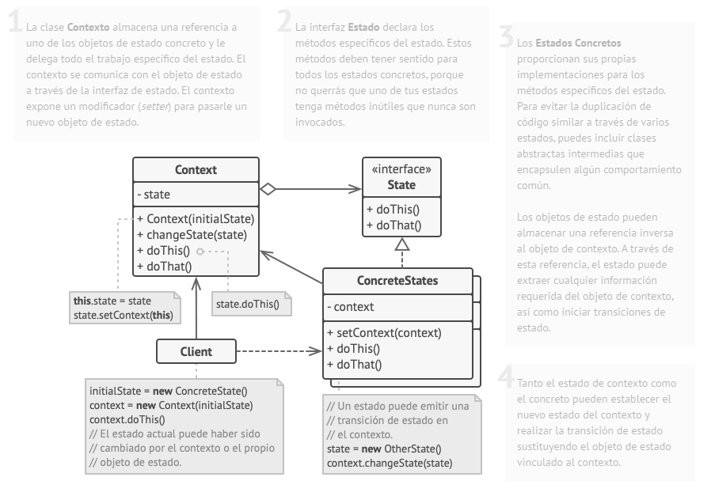
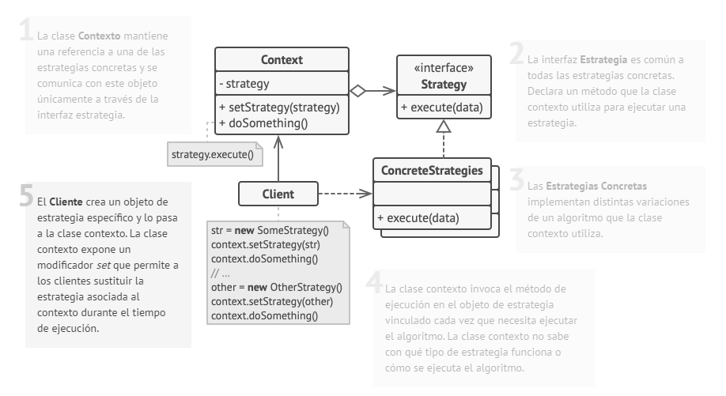
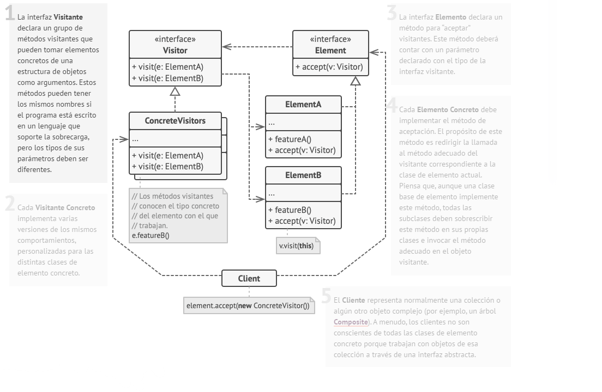

# Patrones de Comportamiento

## Chain of Responsability
También llamado: **Cadena de Responsabilidad**  
Ejemplo de uso: **Middleware**

### Proposito

Patrón de diseño de comportamiento que te permite pasar solicitudes a lo largo de una cadena de manejadores. Al recibir una solicitud, cada manejador decide si la procesa o si la pasa al siguiente manejador de la cadena.

### Problema

Cuando hay comunicación entre 2 objetos, normalmente estos se acoplan mediante una conexión. Pretendemos desacoplar el sistema, pero nuestro problema es que el receptor del mensaje no va a conocer directamente el origen del mismo. El patrón Chain of Resbonsability trata de resolver esta situación.

Se aplica cuando:

- Varios objetos pueden manejar cierta petición, y el manejador no se conoce a priori, sino que debería determinarse automáticamente.
- Pretendemos enviar un mensaje a un objeto entre varios sin especificar explícitamente el receptor.
- Los objetos que pueden tratar el mensaje deberían ser especificados dinámicamente.

### Solucion

Para solucionar este problema debemos encontrar un mecanismo mediante el cual pasar mensajes a través la cadena de objetos, para que si el que lo recibe no sabe procesarlo lo pase a otro objeto.

Para lograr esto, crearemos una interfaz Manejador que permite tratar las peticiones en general. Crearemos también algunos ManejadoresConcretos que son los que se encargan de procesar una petición concreta. El cliente que desea enviar el mensaje pasará el mismo a un Manejardor concreto, que se encargará o bien de procesarlo o bien de transferirlo a otros objetos que pertenezcan a la cadena.

### Estructura

## Command
También llamado: ****

### Proposito

### Problema

### Solucion

### Estructura

## Iterator
También llamado: ****

### Proposito

### Problema

### Solucion

### Estructura

## Mediator
También llamado: ****

### Proposito

### Problema

### Solucion

### Estructura

## Memento
También llamado: ****

### Proposito

### Problema

### Solucion

### Estructura

## Observer
También llamado: ****

### Proposito

### Problema

### Solucion

### Estructura

## State
También llamado: ****

### Proposito

### Problema

### Solucion

### Estructura

## Strategy
También llamado: ****

### Proposito

### Problema

### Solucion

### Estructura

## Template Method
También llamado: ****

### Proposito

### Problema

### Solucion

### Estructura

## Visitor
También llamado: ****

### Proposito

### Problema

### Solucion

### Estructura

