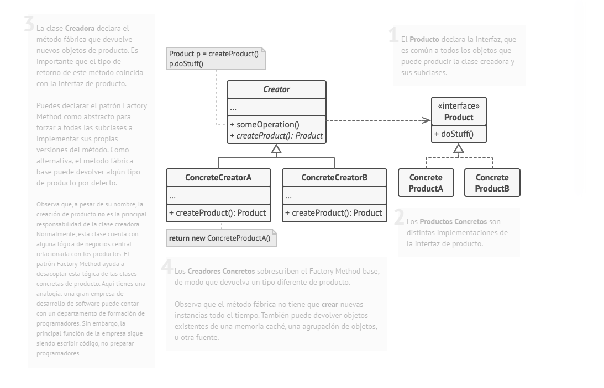
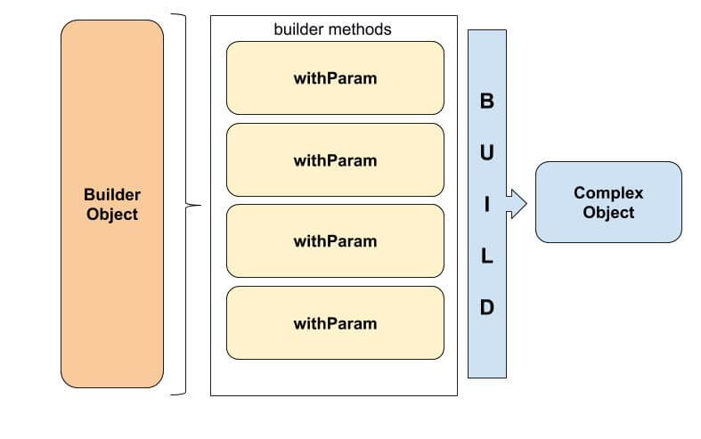
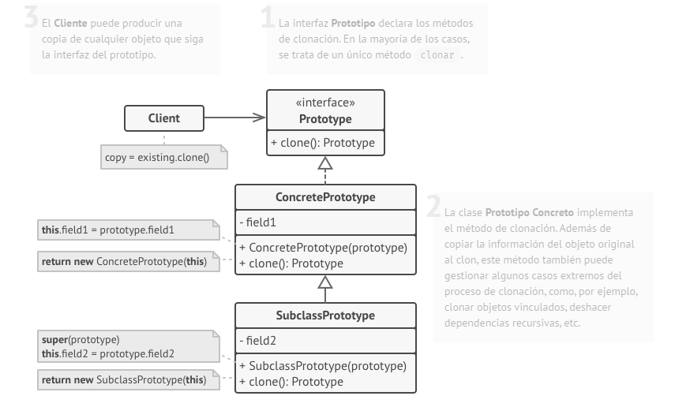
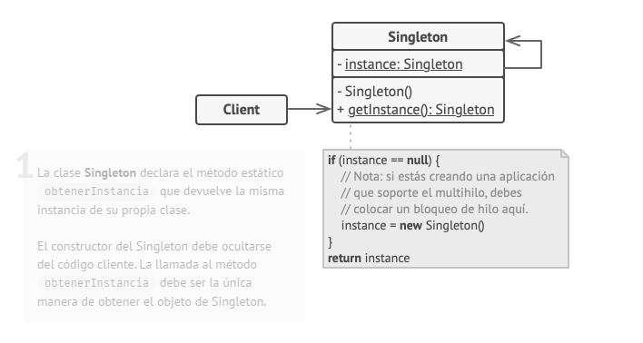

# Patrones Creacionales

Los patrones creacionales proporcionan formas de creacion de objetos y permiten la reutilización de codigo existente.


## Factory Method
También llamado: **Metodo de fábrica**

### Proposito

Consiste en la creacion de instancias de una superclase o interface y poder devolverlas en instancias de la subclase

El patrón Factory Method sugiere que, en lugar de llamar al operador new para construir objetos directamente, se invoque a un método fábrica especial

### Problema

Suponiendo una aplicacion de control de logistica, en la primera versión del codigo, lo realizas pensando en que el metodo de transporte es, por ejemplo, `camion`, pero mas adelante tienes las necesidades de agregar mas metodos como maritimo, aereo, etc.

Al final te ves obligado a repetir codigo o tener que agregar condicionales extras, etc.


### Solucion

La solución es implementar un nivel de abstraccion creando una `interface Transporte`, las clases de transporte `Camion`, `Barco`, `Avion` por ejemplo y estas deberan de implementar la interface `Transporte`.


Una clase abstracta o interface `MedioTransporte` y tendra un metodo para crear un transporte y creamos subclases que sean referentes a `Tierra`, `Agua`, `Aire`. 

En el medio de transporte por tierra se pueden usar Camiones, trenes, etc.  
Entonces lo que se hace es crear un metodo de factoria que devuelva un `Transporte`(clase abstracta o interface) y ahi es donde se realizara la logica de devolver una instancia de la clase `Camion` o `Tren` o la correspondiente.


### Estructura




---
## Abstract Method
También llamado: **Fábrica Abstracta**

### Proposito

Permite producir familias de objetos relacionados sin especificar sus clases concretas.

El patrón Abstract Factory está aconsejado cuando se prevé la inclusión de nuevas familias de productos, pero puede resultar contraproducente cuando se añaden nuevos productos o cambian los existentes, puesto que afectaría a todas las familias creadas.

### Problema

Debemos crear diferentes objetos, todos pertenecientes a la misma familia. Por ejemplo: las bibliotecas para crear interfaces gráficas suelen utilizar este patrón y cada familia sería un sistema operativo distinto. Así pues, el usuario declara un Botón, pero de forma más interna lo que está creando es un BotónWindows o un BotónLinux, por ejemplo.

El problema que intenta solucionar este patrón es el de crear diferentes familias de objetos.

### Solucion

Para mostrar el concepto del Abstract Factory vamos a hacer un sencillo reloj que nos muestra la hora actual. Como sabemos, la hora puede ser desplegada en formato de 24Hrs o puede ser desplegada en formato AM/PM.

```Java
public abstract class Reloj {
 
    abstract String dameLaHora();
}

public class RelojAmPm extends Reloj{
 
    public RelojAmPm(){
 
    }
 
    public String dameLaHora() {
        Date d = new Date();
        int hora = d.getHours();
        int minutos = d.getMinutes();
        int segundos = d.getSeconds();
        String tr;
        if (hora&lt;=12){
            tr="Son las "+hora+":"+minutos+":"+segundos+" AM";
        } else {
            tr="Son las "+(hora-12)+":"+minutos+":"+segundos+" PM";
        }
 
        return tr;
    }
 
}

public class Reloj24Hrs extends Reloj {
 
    public String dameLaHora() {
        Date d = new Date();
        int hora = d.getHours();
        int minutos = d.getMinutes();
        int segundos = d.getSeconds();
        String tr;
        tr = "Son las " + hora + ":" + minutos + ":" + segundos + " ";
 
        return tr;
    }
}

public class RelojFactory {
    public static final int RELOJ_AM_PM=0;
    public static final int RELOJ_24_HRS=1;
 
    public RelojFactory(){
 
    }
 
    public static Reloj createReloj(int tipoDeReloj){
        if (tipoDeReloj==RelojFactory.RELOJ_24_HRS){
            return new Reloj24Hrs();
        }
        if (tipoDeReloj==RelojFactory.RELOJ_AM_PM){
            return new RelojAmPm();
        }
 
        return null;
    }
 
}

public class MainClient {
 
    public static void main(String[] args) {
        Reloj r = RelojFactory.createReloj(RelojFactory.RELOJ_24_HRS);
        System.out.println(r.dameLaHora());
    }
}
```

### Estructura


---
## Builder
También llamado: **Constructor**

### Proposito

Es un patrón de diseño creacional que nos permite construir objetos complejos paso a paso. El patrón nos permite producir distintos tipos y representaciones de un objeto empleando el mismo código de construcción.

### Problema

Imaginemos una funcion que recibe muchos parametros para devolver una Query SQL formada, algo como:

```csharp
public string ResolveQuery(string select, string from, string where, string orderBy, string limit);

ResolveQuery("Id", "table", null, null, null);
ResolveQuery("Id", "table", "Id = 1", null, null);
```

Este codigo si nos fijamos es muy engorroso y nada descriptivo, porque si no necesitamos de todos los parametros, encima tenemos que enviar los datos a null.

### Solucion

Para la solución se puede crear una clase que implemente una serie de metodos para agregar las opciones, basicamente, pasar los parametros a ser funciones e ir agregandolos a variables de clase privadas y una funcion `Build()`, que se encargara de montarlo todo y devolver lo que se necesita.

```csharp
internal interface IPatronBuilder
{
    string Build();
    IPatronBuilder From(string from);
    IPatronBuilder OrderBy(string orderBy);
    IPatronBuilder Select(string select);
    IPatronBuilder Where(string where);
}

internal class PatronBuilder : IPatronBuilder
{
    private string _select;
    private string _where;
    private string _from;
    private string _orderby;

    public IPatronBuilder Select(string select)
    {
        _select = select;
        return this;
    }

    public IPatronBuilder Where(string where)
    {
        _where = where;
        return this;
    }

    public IPatronBuilder From(string from)
    {
        _from = from;
        return this;
    }

    public IPatronBuilder OrderBy(string orderBy)
    {
        _orderby = orderBy;
        return this;
    }

    public string Build()
    {
        var query = new StringBuilder();

        query.AppendLine($"SELECT {(!string.IsNullOrEmpty(_select) ? _select : "*")}");
        query.AppendLine($"FROM {_from}");

        if (!string.IsNullOrEmpty(_where))
        {
            query.AppendLine($"WHERE {_where}");
        }
        if (!string.IsNullOrEmpty(_orderby))
        {
            query.AppendLine($"ORDER BY {_orderby}");
        }

        return query.ToString();
    }
}


public static void Main(string[] args)
{
    var claseImplementaBuilder1 = new PatronBuilder();
    var claseImplementaBuilder2 = new PatronBuilder();
    var claseImplementaBuilder3 = new PatronBuilder();


    var query1 = claseImplementaBuilder1
        .Select("Id")
        .From("table")
        .Where("1 = 1")
        .OrderBy("Id")
        .Build();

    var query2 = claseImplementaBuilder2
        .From("table")
        .Build();

    var query3 = claseImplementaBuilder3
        .Select("Hola")
        .From("tableFrom")
        .Build();

    Console.WriteLine(query1);
    Console.WriteLine(query2);
    Console.WriteLine(query3);
}
```
De esta manera, la forma de crear la query es mucho mas clara por los nombres de las funciones y al poder concatenarse y usar el metodo Build() para la creacion de todo, es mucho mas claro.

### Estructura



---
## Prototype
También llamado: **Patron clon o prototipo**

### Proposito

Permite copiar objetos existentes sin que el código dependa de sus clases

### Problema

Digamos que tienes un objeto y quieres crear una copia exacta de él. ¿Cómo lo harías? En primer lugar, debes crear un nuevo objeto de la misma clase. Después debes recorrer todos los campos del objeto original y copiar sus valores en el nuevo objeto.

¡Bien! Pero hay una trampa. No todos los objetos se pueden copiar de este modo, porque algunos de los campos del objeto pueden ser privados e invisibles desde fuera del propio objeto.

### Solucion

El patrón Prototype delega el proceso de clonación a los propios objetos que están siendo clonados. El patrón declara una interfaz común para todos los objetos que soportan la clonación. Esta interfaz nos permite clonar un objeto sin acoplar el código a la clase de ese objeto. Normalmente, dicha interfaz contiene un único método clonar.

La implementación del método clonar es muy parecida en todas las clases. El método crea un objeto a partir de la clase actual y lleva todos los valores de campo del viejo objeto, al nuevo. Se puede incluso copiar campos privados, porque la mayoría de los lenguajes de programación permite a los objetos acceder a campos privados de otros objetos que pertenecen a la misma clase.

Un objeto que soporta la clonación se denomina prototipo. Cuando tus objetos tienen decenas de campos y miles de configuraciones posibles, la clonación puede servir como alternativa a la creación de subclases.

### Estructura



---
## Singleton
También llamado: **Instancia única**

### Proposito

Es un patron que nos permite asegurarnos de que una clase, tenga solamente una instancia unica, proporcionando un acceso global a dicha instancia

### Problema

1. **Garantizar que una clase tenga una unica instancia.** Lo habitual de esto es controlar el acceso a algun recurso compartido, como Bases de datos, etc.

2. **Proporcionar un punto de acceso global a dicha instancia** Gracias a este patrón, se podra acceder a la instancia desde cualquier parte del codigo y se evita que se sobreescriba.

### Solucion

Todas las implementaciones de Singleton se realizan de la siguiente forma:

- Hacer el contructor de la clase privado, para que no se pueda realizar un `new X()` desde ningun lado, puesto que romperia el patron.
- Crear un método static que cree la instancia de la clase y guardar el objeto generado en una variable privada que actue como `cache`, cuando se requiera volver a instanciar el metodo, se devolvera directamente el objeto guardado.

Un ejemplo de un patron Singleton, podria ser la implementacion de una Caché, para tener datos en memoria

### Estructura


