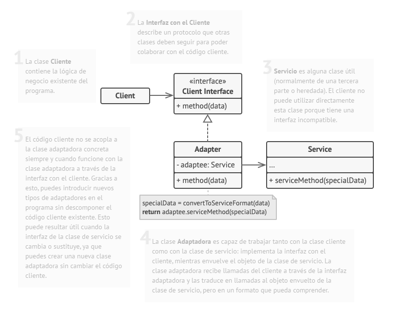
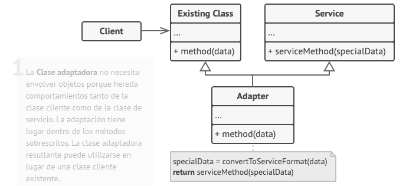
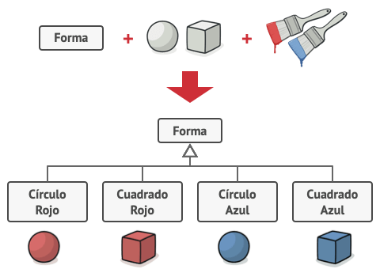
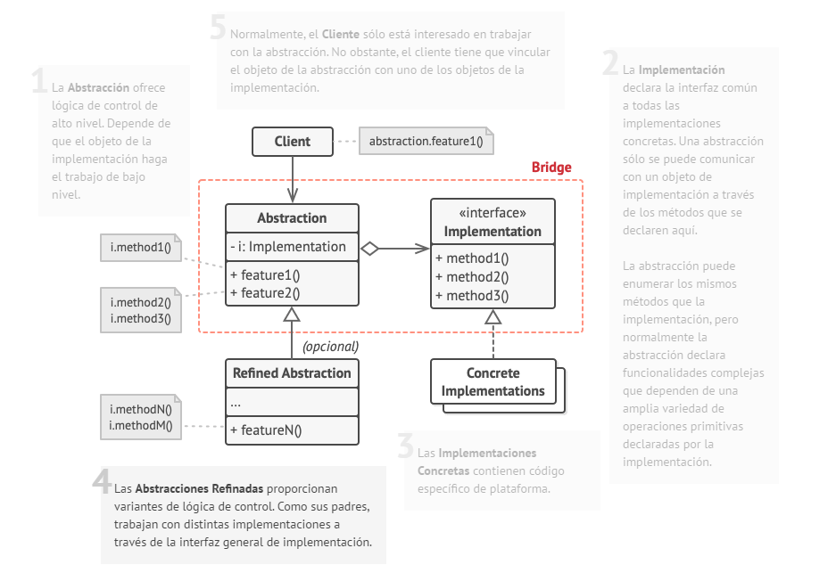
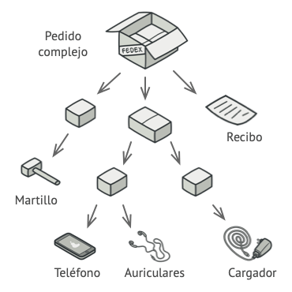
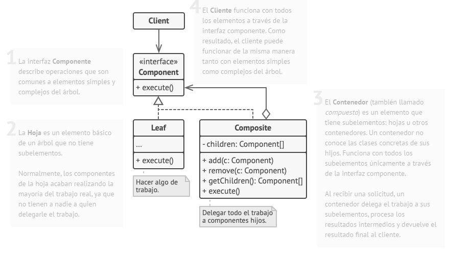

# Patrones Estructurales
Los patrones estructurales explican cómo ensamblar objetos y clases en estructuras más grandes, a la vez que se mantiene la flexibilidad y eficiencia de estas estructuras

## Adapter
También llamado: **Adaptador**

### Proposito

Es un patron de diseño estructural que permite la colaboración entre objetos con interfaces incompatibles.

### Problema

Supongamos que estamos realizando una aplicacion en la que obtenemos datos en un formato, como `XML` y necesitamos enviar esos datos a un API de analisis, pero dicho API espera recibirlos en formato `JSON` para tratar los datos.  
Un error seria modificar el API, puesto que este espera el estandard JSON, pero si enviamos los datos en XML, logicamente no funcionaria.

### Solucion

Se puede crear un *adaptador*. Un objeto que se convierte la interfaz de un objeto, de forma que otro pueda ser capaz de comprenderla.

Un adaptador se encargar de convertir un objeto a otro tipo de datos sin que este sea consciente ni siquiera de la existencia de tal proceso. Esta pensado para ocultar la complejidad del codigo correspondiente de realizar la conversión con la logica de codigo normal que se deberia de seguir.

El funcionamiento es el siguiente.

1. El adaptador obtiene una interfaz compatible con uno de los objetos.
2. Haciendo uso de esta interfaz, se pueden invocar los metodos del adaptador.
3. Al recibir una llamada, el adaptador pasa la solicitud al siguiente objeto, pero en el formato que este espera.

### Estructura

**Adatador de Objetos**

Utiliza el principio de composicion de objetos, implementa la interfaz de un objeto y envuelve el otro

**Clase Adaptadora**

Esta implementacion hace uso de la herencia, porque esta hereda interfaces de ambos objetos al mismo tiempo. ***Este metodo solo puede usarse en lenguajes con herencia multiple***

## Bridge
También llamado: **Puente**

### Proposito

Permite dividir una clase grande, o un grupo de clases relacionadas, en dos jerarquias separadas(abstracción e implementación) que pueden desarrollarse de forma independiente.

### Problema

Digamos que tienes una clase geométrica Forma con un par de subclases: Círculo y Cuadrado. Deseas extender esta jerarquía de clase para que incorpore colores, por lo que planeas crear las subclases de forma Rojo y Azul. Sin embargo, como ya tienes dos subclases, tienes que crear cuatro combinaciones de clase, como CírculoAzul y CuadradoRojo.

Añadir nuevos tipos de forma y color a la jerarquía hará que ésta crezca exponencialmente. Por ejemplo, para añadir una forma de triángulo deberás introducir dos subclases, una para cada color. Y, después, para añadir un nuevo color habrá que crear tres subclases, una para cada tipo de forma. Cuanto más avancemos, peor será.

### Solucion

Este problema se presenta porque intentamos extender las clases de forma en dos dimensiones independientes: por forma y por color. Es un problema muy habitual en la herencia de clases.

El patrón Bridge intenta resolver este problema pasando de la herencia a la composición del objeto. Esto quiere decir que se extrae una de las dimensiones a una jerarquía de clases separada, de modo que las clases originales referencian un objeto de la nueva jerarquía, en lugar de tener todo su estado y sus funcionalidades dentro de una clase.

Con esta solución, podemos extraer el código relacionado con el color y colocarlo dentro de su propia clase, con dos subclases: Rojo y Azul. La clase Forma obtiene entonces un campo de referencia que apunta a uno de los objetos de color. Ahora la forma puede delegar cualquier trabajo relacionado con el color al objeto de color vinculado. Esa referencia actuará como un puente entre las clases Forma y Color. En adelante, añadir nuevos colores no exigirá cambiar la jerarquía de forma y viceversa.

### Estructura

## Composite
También llamado: **Objeto Compuesto**

### Proposito

### Problema

El uso del patrón Composite sólo tiene sentido cuando el modelo central de tu aplicación puede representarse en forma de árbol.

Por ejemplo, imagina que tienes dos tipos de objetos: Productos y Cajas. Una Caja puede contener varios Productos así como cierto número de Cajas más pequeñas. Estas Cajas pequeñas también pueden contener algunos Productos o incluso Cajas más pequeñas, y así sucesivamente.

Digamos que decides crear un sistema de pedidos que utiliza estas clases. Los pedidos pueden contener productos sencillos sin envolver, así como cajas llenas de productos... y otras cajas. ¿Cómo determinarás el precio total de ese pedido?

### Solucion

El patrón Composite sugiere que trabajes con Productos y Cajas a través de una interfaz común que declara un método para calcular el precio total.

¿Cómo funcionaría este método? Para un producto, sencillamente devuelve el precio del producto. Para una caja, recorre cada artículo que contiene la caja, pregunta su precio y devuelve un total por la caja. Si uno de esos artículos fuera una caja más pequeña, esa caja también comenzaría a repasar su contenido y así sucesivamente, hasta que se calcule el precio de todos los componentes internos. Una caja podría incluso añadir costos adicionales al precio final, como costos de empaquetado.

La gran ventaja de esta solución es que no tienes que preocuparte por las clases concretas de los objetos que componen el árbol. No tienes que saber si un objeto es un producto simple o una sofisticada caja. Puedes tratarlos a todos por igual a través de la interfaz común. Cuando invocas un método, los propios objetos pasan la solicitud a lo largo del árbol.

### Estructura

## Decorator
También llamado: **Instancia única**

### Proposito

### Problema

### Solucion

### Estructura

## Facade
También llamado: **Instancia única**

### Proposito

### Problema

### Solucion

### Estructura

## Flyweight
También llamado: **Instancia única**

### Proposito

### Problema

### Solucion

### Estructura

## Proxy
También llamado: **Instancia única**

### Proposito

### Problema

### Solucion

### Estructura

